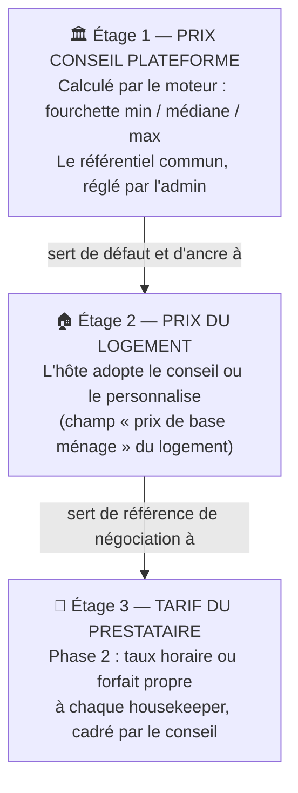
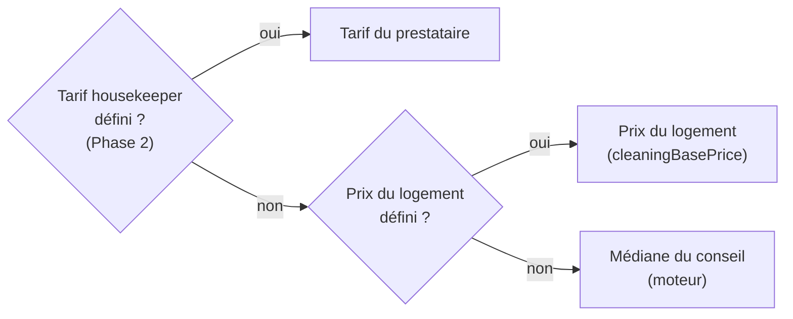
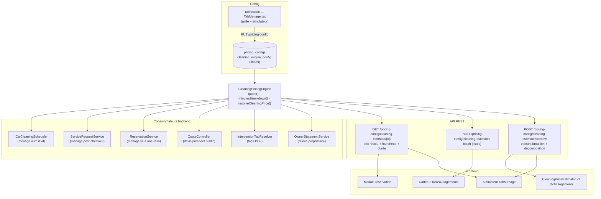
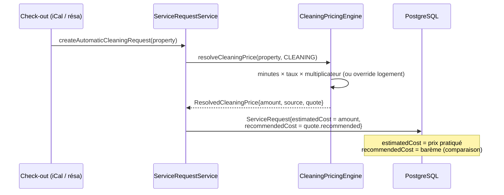

# Moteur Ménage Baitly — Documentation collaborateurs

> **Version** : Phase 1 (2026-07-10) · Document vivant, enrichi à chaque phase du chantier.
> **Public** : équipes métier (produit, support, opérations) **et** techniques (dev, ops).
> Les sections marquées 🔧 sont techniques ; les autres se lisent sans connaissance du code.

---

## 1. Pourquoi ce moteur ? (le problème qu'on résout)

### Avant

Le prix d'un ménage dans Baitly venait de **trois calculs différents qui ne se parlaient pas** :

| Où | Comment le prix était calculé | Problème |
|---|---|---|
| Interventions automatiques | Formule « forfait de l'abonnement × coefficients » | Utilisée seulement par la planification iCal |
| Fiche logement (éditeur) | Formule dans le navigateur (surface + suppléments) | Résultat **jamais enregistré**, différent des interventions |
| Devis prospects (site public) | Troisième formule, coefficients commerciaux | Encore un autre montant |

Résultat concret : pour le même logement, la fiche affichait **~50 €**, les interventions facturaient **95 €**, et le devis commercial annonçait un troisième chiffre. De plus, la plupart des flux réels (ménage après check-out, réservations, imports Airbnb/Booking) utilisaient le champ « prix de base ménage » du logement **brut** — souvent vide, donc 0 €.

### Après (Phase 1)

**Un seul moteur** calcule le prix conseillé partout, à partir d'une idée simple :

> **Un ménage, c'est du temps de travail.** Le moteur estime les minutes nécessaires selon le logement, les multiplie par un taux horaire, et obtient **à la fois la durée et le prix** — le même chiffre sur tous les écrans et documents.

### Ce que ça apporte

- **Cohérence** : fiche logement, table, modale de réservation, interventions, documents PDF, devis, relevé propriétaire — tous affichent le même référentiel.
- **Transparence** : le prix se décompose ligne par ligne (« 2 chambres : 120 min, 1 étage supplémentaire : 15 min… ») — c'est ce qui le rend acceptable et explicable.
- **Pilotage** : l'administrateur règle toute la grille (minutes, taux, multiplicateurs) dans un écran unique, avec simulateur.
- **Positionnement marché** : d'après notre benchmark (juillet 2026), **aucun PMS concurrent ne calcule un prix de ménage conseillé** — le prix y est partout saisi à la main, configuré en forfait fixe, ou délégué à un marketplace externe.

---

## 2. Les trois étages de prix (concept clé)

Le système distingue désormais trois notions qui étaient confondues :



**Règle de résolution du prix d'une intervention** (qui gagne ?) :



Quel que soit le prix retenu, **le conseil est toujours enregistré à côté** (« snapshot ») : on peut donc comparer partout *prix pratiqué* vs *barème conseillé* — c'est la base du cadrage des tarifs prestataires (Phase 2) et de la mention « conforme au barème » du relevé propriétaire.

---

## 3. La formule, pas à pas

### Étape 1 — Les minutes de travail

| Composant du logement | Minutes ajoutées (défauts) |
|---|---|
| Base selon chambres | 0-1 ch : 90 · 2 ch : 120 · 3 ch : 150 · 4 ch : 180 · 5+ : 210 |
| Salle de bain supplémentaire (au-delà de 1) | +15 / SDB |
| Surface au-delà de 80 m² | +1 min / 5 m² |
| Étage supplémentaire (au-delà de 1) | +15 / étage |
| Extérieur (terrasse, jardin) | +20 |
| Buanderie / gestion du linge | +15 |
| Voyageur au-delà de 4 | +5 / voyageur |

### Étape 2 — Le prix

```
prix = (minutes ÷ 60) × taux horaire (42 €/h par défaut) × multiplicateur du type de ménage
```

| Type de ménage | Multiplicateur | Logique |
|---|---|---|
| Express (mi-séjour) | × 0,65 | Moins approfondi (standard marché : −30 à −50 %) |
| **Standard (turnover)** | × 1,0 | Le ménage entre deux séjours |
| Deep clean (grand ménage) | × 1,6 | Standard marché : +50 à +100 % |

Puis : arrondi au multiple de **5 €**, plancher **30 €**, et fourchette **± 15 %** autour du prix conseillé (l'ancre visuelle est **toujours la médiane**, jamais le minimum).

### Exemple réel — « Appartement Duplex Marrakech »

| | |
|---|---|
| Profil | 2 chambres · 1 SDB · 50 m² · 2 niveaux · 4 voyageurs |
| Minutes | base 120 + étage sup. 15 = **135 min** (2 h 15) |
| Prix standard | 135/60 × 42 € = 94,50 → arrondi **95 €** |
| Fourchette | **80 € – 110 €** |
| Express / Deep | 60 € / 150 € |

C'est exactement le tarif que le système d'interventions produisait déjà pour ce logement — la calibration du taux horaire (42 €/h) a été choisie pour ça : **aucun changement de prix pour l'existant**, mais désormais le même chiffre partout.

---

## 4. Guide par écran (qui voit quoi)

### 4.1 Admin / gestionnaire — Tarification → onglet « Ménage »

- **Grille complète éditable** : minutes par composant, taux horaire, multiplicateurs, fourchette, arrondi, plancher. Champ laissé vide = valeur par défaut plateforme.
- **Simulateur** : choisir un logement → prix par type de ménage + fourchette + durée + décomposition minutes. La simulation utilise la **grille enregistrée** (sauvegarder avant de simuler, l'écran le rappelle).

### 4.2 Hôte — fiche logement (éditeur de prix ménage)

- Affiche les 3 types de ménage avec **médiane mise en avant**, fourchette et durée discrètes.
- **Décomposition transparente** : chaque ligne de minutes est visible.
- Bouton **« Adopter comme prix du logement »** : enregistre le conseil comme prix du logement (étage 2). Sinon l'hôte garde/saisit son propre prix.

### 4.3 Création de réservation (modale PMS)

- Les frais de ménage sont préremplis avec le **prix résolu** (étage 2 sinon conseil) — modifiables.

### 4.4 Liste des logements (cartes + tableau)

- Le prix de ménage affiché = prix résolu (une seule requête groupée pour toute la page).

### 4.5 Documents PDF (bon d'intervention, validation de fin de mission, facture)

Nouveaux champs disponibles dans les modèles de documents :

| Tag | Contenu |
|---|---|
| `${intervention.prix_conseil}` | Prix conseillé (snapshot, sinon calcul live) |
| `${intervention.fourchette}` | « 80 € – 110 € » |
| `${intervention.duree_normee}` | « 2 h 15 » |
| `${intervention.decomposition}` | Détail des minutes par composant |

Un tag sans donnée s'affiche vide — il ne peut **jamais** faire échouer la génération d'un PDF.

### 4.6 Devis prospects (site public)

Le devis commercial s'appuie désormais sur le **même moteur** (avec ses coefficients commerciaux : nombre de logements, fréquence, gamme d'abonnement). Ce que le devis promet correspond à ce que le produit calcule.

### 4.7 Relevé propriétaire (email mensuel)

Chaque prestation de ménage affiche « **Barème conseillé : X €** » à côté du montant facturé — ou « **conforme au barème** » si l'écart est ≤ 5 €.

---

## 5. 🔧 Architecture technique

### 5.1 Vue d'ensemble



### 5.2 Le service moteur

`server/src/main/java/com/clenzy/service/pricing/CleaningPricingEngine.java`

| API | Rôle |
|---|---|
| `quote(CleaningInputs, type)` / `quote(Property, type)` | → `CleaningQuote{durationMinutes, recommended, min, max}` |
| `minutesBreakdown(inputs)` | Décomposition : base / bathrooms / surface / floors / exterior / laundry / guests |
| `resolveCleaningPrice(property, type)` | → `ResolvedCleaningPrice{amount, source, quote}` — source = `PROPERTY_OVERRIDE` \| `ENGINE` (extension `HOUSEKEEPER_RATE` prévue Phase 2) |

Config lue depuis le JSON org (`PricingConfigService.getCleaningEngineConfigJson()`), **parse tolérant champ à champ** : clé absente ou JSON invalide → défauts Java. Défauts calibrés : `DEFAULT_HOURLY_RATE = 42.0` (vérifié par test `whenMarrakechProfile_thenCleaningRecommendedIs95`).

### 5.3 Modèle de données (migrations Liquibase)

| Migration | Contenu |
|---|---|
| `0336__add_cleaning_engine_config.sql` | `pricing_configs.cleaning_engine_config TEXT` (JSON de la grille) |
| `0337__add_recommended_cost_snapshot.sql` | `recommended_cost NUMERIC(10,2)` sur `service_requests` **et** `interventions` |

Le **snapshot** `recommended_cost` est posé à la création (scheduler iCal, ménage post-checkout, réservation, copie SR→intervention) et exposé dans `ServiceRequestDto`, `InterventionDto`, `InterventionResponse`. Il fige le conseil du moment — même si la grille change ensuite, la comparaison reste juste.

### 5.4 Structure du JSON de configuration

```json
{
  "hourlyRate": 42.0,
  "componentMinutes": {
    "baseByBedrooms": {"0": 90, "1": 90, "2": 120, "3": 150, "4": 180, "5plus": 210},
    "perExtraBathroom": 15,
    "surfaceThresholdSqm": 80, "perSurfaceStepSqm": 5, "surfaceStepMinutes": 1,
    "perExtraFloor": 15, "exterior": 20, "laundry": 15, "perGuestAbove4": 5
  },
  "cleaningTypeMultipliers": {"EXPRESS_CLEANING": 0.65, "CLEANING": 1.0, "DEEP_CLEANING": 1.6},
  "rangePercent": 15, "roundTo": 5, "minPrice": 30
}
```

### 5.5 Séquence — création d'un ménage automatique (post-checkout)



### 5.6 Sécurité

- Endpoints `@PreAuthorize("isAuthenticated()")`, propriétés chargées **org-scopées** (`getSecuredPropertyEntity` : filtre tenant + `requireSameOrganization`).
- Batch borné à 200 identifiants ; les propriétés hors org sont omises silencieusement.
- Le devis prospect (public) lit la config **plateforme** (repli sans tenant), aucun changement d'exposition.

### 5.7 Tests

- `CleaningPricingEngineTest` : 14 tests (calibration Marrakech, décomposition, multiplicateurs, plancher, arrondi, fourchette, config custom/invalide, résolveur).
- `InterventionTagResolverTest` : les 4 tags avec/sans snapshot, fallback vide.
- Suite complète verte : `mvn package` (~11 800 tests) + `tsc --noEmit`.

---

## 6. Décisions & justifications (pour mémoire)

| Décision | Justification |
|---|---|
| Minutes × taux plutôt que forfait × coefficients | Un calcul = durée ET prix ; explicable ligne à ligne ; pattern « Piece Pay in Hours » (Operto Teams) |
| Fourchette ancrée sur la médiane | Leçon Airbnb Smart Pricing : le minimum affiché devient un aimant vers le bas |
| Nudge, jamais de blocage des tarifs | Pattern Upwork/Turno ; les prix imposés opaques (Uber/Wecasa) sont rejetés par les pros |
| Snapshot du conseil à la création | Comparer pratiqué vs conseillé même si la grille évolue |
| Un tag PDF ne casse jamais la génération | Un document non généré = incident opérationnel ; une valeur vide = acceptable |
| Calibration 42 €/h | Continuité : l'existant produisait 95 € pour le logement de référence |

---

## 7. Phases suivantes (alimenté au fil du chantier)

### Phase 2 — Tarifs housekeeper + canaux terrain *(à venir)*

- Tarif propre par prestataire (taux horaire et/ou forfait par logement, le forfait primant), écran « Mes tarifs », nudge fourchette à la saisie, badge d'écart sur les interventions.
- Réparation du push mobile (aujourd'hui inopérant), email « mission assignée » au prestataire avec sa rémunération, montants dans les notifications (chacun voit **son** montant).

### Phase 3 — Boucle opérationnelle *(à venir)*

- Devis ménage interne (PDF au propriétaire), paiement du prestataire à la complétion **conditionné à la checklist photo**, signalement d'anomalie → devis maintenance, auto-assignation (disponibilité + tarif + score qualité).

---

## 8. Glossaire

| Terme | Définition |
|---|---|
| **Prix conseil / barème** | Prix calculé par le moteur : la recommandation plateforme (fourchette) |
| **Prix résolu** | Le prix effectivement retenu après la règle de résolution (§2) |
| **Snapshot (`recommended_cost`)** | Copie du conseil enregistrée sur chaque intervention à sa création |
| **Minutes normées** | Temps de travail estimé du logement, base commune de la durée et du prix |
| **Turnover** | Ménage entre deux séjours (type « standard ») |
| **SR (Service Request)** | La demande d'intervention (avant paiement) ; l'**Intervention** est son exécution |
