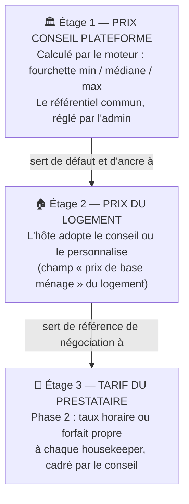
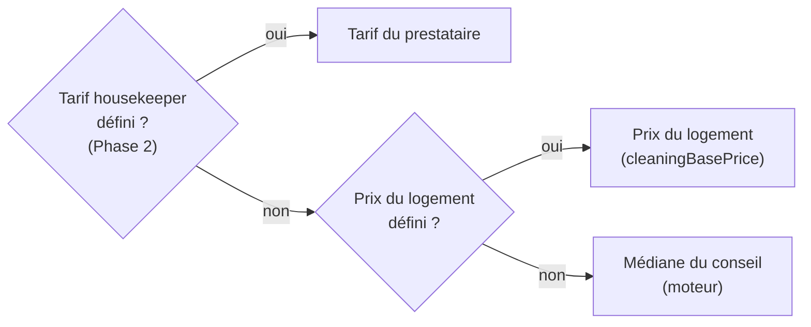
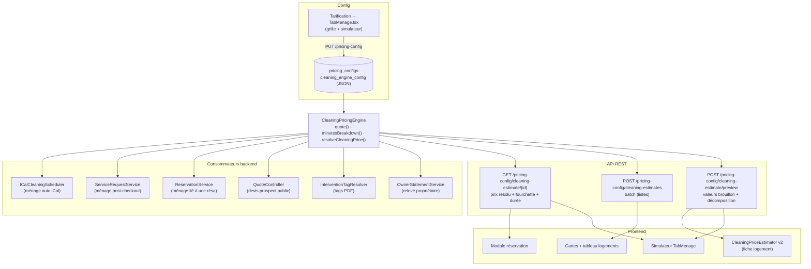
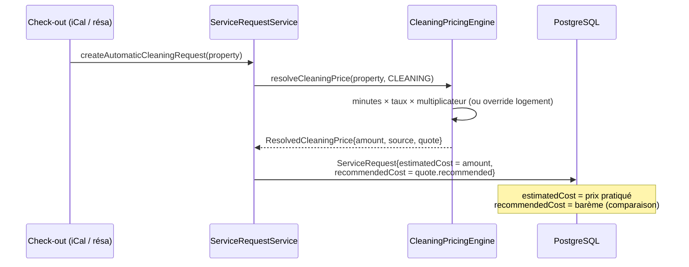
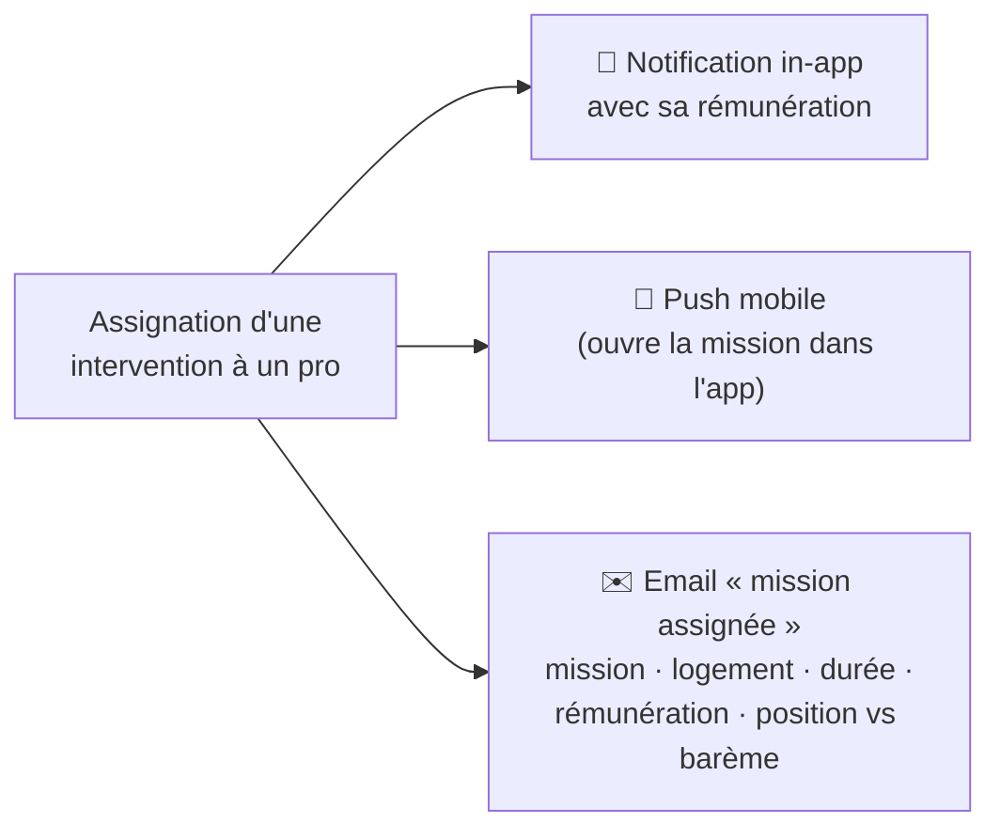
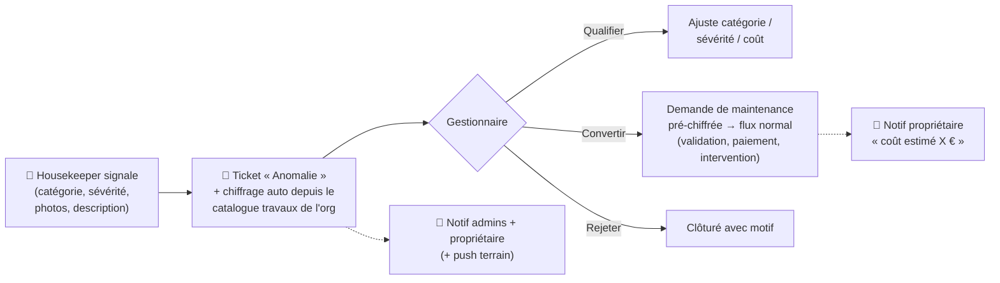
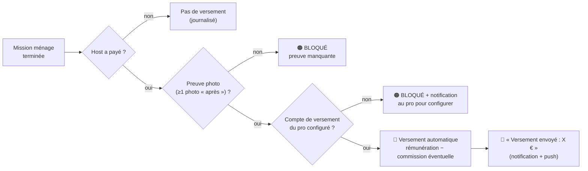

# Moteur Ménage Baitly — Documentation collaborateurs

> **Version** : Phase 1 (2026-07-10) · Document vivant, enrichi à chaque phase du chantier.
> **Public** : équipes métier (produit, support, opérations) **et** techniques (dev, ops).
> Les sections marquées 🔧 sont techniques ; les autres se lisent sans connaissance du code.

---

## 1. Pourquoi ce moteur ? (le problème qu'on résout)

### Avant

Le prix d'un ménage dans Baitly venait de **trois calculs différents qui ne se parlaient pas** :

| Où | Comment le prix était calculé | Problème |
|---|---|---|
| Interventions automatiques | Formule « forfait de l'abonnement × coefficients » | Utilisée seulement par la planification iCal |
| Fiche logement (éditeur) | Formule dans le navigateur (surface + suppléments) | Résultat **jamais enregistré**, différent des interventions |
| Devis prospects (site public) | Troisième formule, coefficients commerciaux | Encore un autre montant |

Résultat concret : pour le même logement, la fiche affichait **~50 €**, les interventions facturaient **95 €**, et le devis commercial annonçait un troisième chiffre. De plus, la plupart des flux réels (ménage après check-out, réservations, imports Airbnb/Booking) utilisaient le champ « prix de base ménage » du logement **brut** — souvent vide, donc 0 €.

### Après (Phase 1)

**Un seul moteur** calcule le prix conseillé partout, à partir d'une idée simple :

> **Un ménage, c'est du temps de travail.** Le moteur estime les minutes nécessaires selon le logement, les multiplie par un taux horaire, et obtient **à la fois la durée et le prix** — le même chiffre sur tous les écrans et documents.

### Ce que ça apporte

- **Cohérence** : fiche logement, table, modale de réservation, interventions, documents PDF, devis, relevé propriétaire — tous affichent le même référentiel.
- **Transparence** : le prix se décompose ligne par ligne (« 2 chambres : 120 min, 1 étage supplémentaire : 15 min… ») — c'est ce qui le rend acceptable et explicable.
- **Pilotage** : l'administrateur règle toute la grille (minutes, taux, multiplicateurs) dans un écran unique, avec simulateur.
- **Positionnement marché** : d'après notre benchmark (juillet 2026), **aucun PMS concurrent ne calcule un prix de ménage conseillé** — le prix y est partout saisi à la main, configuré en forfait fixe, ou délégué à un marketplace externe.

---

## 2. Les trois étages de prix (concept clé)

Le système distingue désormais trois notions qui étaient confondues :



**Règle de résolution du prix d'une intervention** (qui gagne ?) :



Quel que soit le prix retenu, **le conseil est toujours enregistré à côté** (« snapshot ») : on peut donc comparer partout *prix pratiqué* vs *barème conseillé* — c'est la base du cadrage des tarifs prestataires (Phase 2) et de la mention « conforme au barème » du relevé propriétaire.

---

## 3. La formule, pas à pas

### Étape 1 — Les minutes de travail

| Composant du logement | Minutes ajoutées (défauts) |
|---|---|
| Base selon chambres | 0-1 ch : 90 · 2 ch : 120 · 3 ch : 150 · 4 ch : 180 · 5+ : 210 |
| Salle de bain supplémentaire (au-delà de 1) | +15 / SDB |
| Surface au-delà de 80 m² | +1 min / 5 m² |
| Étage supplémentaire (au-delà de 1) | +15 / étage |
| Extérieur (terrasse, jardin) | +20 |
| Buanderie / gestion du linge | +15 |
| Voyageur au-delà de 4 | +5 / voyageur |

### Étape 2 — Le prix

```
prix = (minutes ÷ 60) × taux horaire (42 €/h par défaut) × multiplicateur du type de ménage
```

| Type de ménage | Multiplicateur | Logique |
|---|---|---|
| Express (mi-séjour) | × 0,65 | Moins approfondi (standard marché : −30 à −50 %) |
| **Standard (turnover)** | × 1,0 | Le ménage entre deux séjours |
| Deep clean (grand ménage) | × 1,6 | Standard marché : +50 à +100 % |

Puis : arrondi au multiple de **5 €**, plancher **30 €**, et fourchette **± 15 %** autour du prix conseillé (l'ancre visuelle est **toujours la médiane**, jamais le minimum).

### Exemple réel — « Appartement Duplex Marrakech »

| | |
|---|---|
| Profil | 2 chambres · 1 SDB · 50 m² · 2 niveaux · 4 voyageurs |
| Minutes | base 120 + étage sup. 15 = **135 min** (2 h 15) |
| Prix standard | 135/60 × 42 € = 94,50 → arrondi **95 €** |
| Fourchette | **80 € – 110 €** |
| Express / Deep | 60 € / 150 € |

C'est exactement le tarif que le système d'interventions produisait déjà pour ce logement — la calibration du taux horaire (42 €/h) a été choisie pour ça : **aucun changement de prix pour l'existant**, mais désormais le même chiffre partout.

---

## 4. Guide par écran (qui voit quoi)

### 4.1 Admin / gestionnaire — Tarification → onglet « Ménage »

- **Grille complète éditable** : minutes par composant, taux horaire, multiplicateurs, fourchette, arrondi, plancher. Champ laissé vide = valeur par défaut plateforme.
- **Simulateur** : choisir un logement → prix par type de ménage + fourchette + durée + décomposition minutes. La simulation utilise la **grille enregistrée** (sauvegarder avant de simuler, l'écran le rappelle).

### 4.2 Hôte — fiche logement (éditeur de prix ménage)

- Affiche les 3 types de ménage avec **médiane mise en avant**, fourchette et durée discrètes.
- **Décomposition transparente** : chaque ligne de minutes est visible.
- Bouton **« Adopter comme prix du logement »** : enregistre le conseil comme prix du logement (étage 2). Sinon l'hôte garde/saisit son propre prix.

### 4.3 Création de réservation (modale PMS)

- Les frais de ménage sont préremplis avec le **prix résolu** (étage 2 sinon conseil) — modifiables.

### 4.4 Liste des logements (cartes + tableau)

- Le prix de ménage affiché = prix résolu (une seule requête groupée pour toute la page).

### 4.5 Documents PDF (bon d'intervention, validation de fin de mission, facture)

Nouveaux champs disponibles dans les modèles de documents :

| Tag | Contenu |
|---|---|
| `${intervention.prix_conseil}` | Prix conseillé (snapshot, sinon calcul live) |
| `${intervention.fourchette}` | « 80 € – 110 € » |
| `${intervention.duree_normee}` | « 2 h 15 » |
| `${intervention.decomposition}` | Détail des minutes par composant |

Un tag sans donnée s'affiche vide — il ne peut **jamais** faire échouer la génération d'un PDF.

### 4.6 Devis prospects (site public)

Le devis commercial s'appuie désormais sur le **même moteur** (avec ses coefficients commerciaux : nombre de logements, fréquence, gamme d'abonnement). Ce que le devis promet correspond à ce que le produit calcule.

### 4.7 Relevé propriétaire (email mensuel)

Chaque prestation de ménage affiche « **Barème conseillé : X €** » à côté du montant facturé — ou « **conforme au barème** » si l'écart est ≤ 5 €.

---

## 5. 🔧 Architecture technique

### 5.1 Vue d'ensemble



### 5.2 Le service moteur

`server/src/main/java/com/clenzy/service/pricing/CleaningPricingEngine.java`

| API | Rôle |
|---|---|
| `quote(CleaningInputs, type)` / `quote(Property, type)` | → `CleaningQuote{durationMinutes, recommended, min, max}` |
| `minutesBreakdown(inputs)` | Décomposition : base / bathrooms / surface / floors / exterior / laundry / guests |
| `resolveCleaningPrice(property, type)` | → `ResolvedCleaningPrice{amount, source, quote}` — source = `PROPERTY_OVERRIDE` \| `ENGINE` (extension `HOUSEKEEPER_RATE` prévue Phase 2) |

Config lue depuis le JSON org (`PricingConfigService.getCleaningEngineConfigJson()`), **parse tolérant champ à champ** : clé absente ou JSON invalide → défauts Java. Défauts calibrés : `DEFAULT_HOURLY_RATE = 42.0` (vérifié par test `whenMarrakechProfile_thenCleaningRecommendedIs95`).

### 5.3 Modèle de données (migrations Liquibase)

| Migration | Contenu |
|---|---|
| `0336__add_cleaning_engine_config.sql` | `pricing_configs.cleaning_engine_config TEXT` (JSON de la grille) |
| `0337__add_recommended_cost_snapshot.sql` | `recommended_cost NUMERIC(10,2)` sur `service_requests` **et** `interventions` |

Le **snapshot** `recommended_cost` est posé à la création (scheduler iCal, ménage post-checkout, réservation, copie SR→intervention) et exposé dans `ServiceRequestDto`, `InterventionDto`, `InterventionResponse`. Il fige le conseil du moment — même si la grille change ensuite, la comparaison reste juste.

### 5.4 Structure du JSON de configuration

```json
{
  "hourlyRate": 42.0,
  "componentMinutes": {
    "baseByBedrooms": {"0": 90, "1": 90, "2": 120, "3": 150, "4": 180, "5plus": 210},
    "perExtraBathroom": 15,
    "surfaceThresholdSqm": 80, "perSurfaceStepSqm": 5, "surfaceStepMinutes": 1,
    "perExtraFloor": 15, "exterior": 20, "laundry": 15, "perGuestAbove4": 5
  },
  "cleaningTypeMultipliers": {"EXPRESS_CLEANING": 0.65, "CLEANING": 1.0, "DEEP_CLEANING": 1.6},
  "rangePercent": 15, "roundTo": 5, "minPrice": 30
}
```

### 5.5 Séquence — création d'un ménage automatique (post-checkout)



### 5.6 Sécurité

- Endpoints `@PreAuthorize("isAuthenticated()")`, propriétés chargées **org-scopées** (`getSecuredPropertyEntity` : filtre tenant + `requireSameOrganization`).
- Batch borné à 200 identifiants ; les propriétés hors org sont omises silencieusement.
- Le devis prospect (public) lit la config **plateforme** (repli sans tenant), aucun changement d'exposition.

### 5.7 Tests

- `CleaningPricingEngineTest` : 14 tests (calibration Marrakech, décomposition, multiplicateurs, plancher, arrondi, fourchette, config custom/invalide, résolveur).
- `InterventionTagResolverTest` : les 4 tags avec/sans snapshot, fallback vide.
- Suite complète verte : `mvn package` (~11 800 tests) + `tsc --noEmit`.

---

## 6. Décisions & justifications (pour mémoire)

| Décision | Justification |
|---|---|
| Minutes × taux plutôt que forfait × coefficients | Un calcul = durée ET prix ; explicable ligne à ligne ; pattern « Piece Pay in Hours » (Operto Teams) |
| Fourchette ancrée sur la médiane | Leçon Airbnb Smart Pricing : le minimum affiché devient un aimant vers le bas |
| Nudge, jamais de blocage des tarifs | Pattern Upwork/Turno ; les prix imposés opaques (Uber/Wecasa) sont rejetés par les pros |
| Snapshot du conseil à la création | Comparer pratiqué vs conseillé même si la grille évolue |
| Un tag PDF ne casse jamais la génération | Un document non généré = incident opérationnel ; une valeur vide = acceptable |
| Calibration 42 €/h | Continuité : l'existant produisait 95 € pour le logement de référence |

---

## 7. Phase 2 — Tarifs housekeeper + canaux terrain

### 7.1 Les tarifs du prestataire (livré)

Chaque housekeeper/technicien peut désormais avoir **ses propres tarifs**, cadrés par le conseil :

| Type de tarif | Portée | Priorité |
|---|---|---|
| **Forfait** | Un logement précis (pattern « prix attaché au couple logement × prestataire ») | 1 — prime toujours |
| **Taux horaire** | Général (tous les logements) : `durée normée du logement × mon taux × type de ménage` | 2 |
| *(aucun tarif)* | — | 3 — prix du logement, sinon conseil |

Le forfait est défini pour le ménage **standard** ; express et deep clean s'en dérivent automatiquement (mêmes proportions que le conseil).

**Écran « Mes tarifs »** (Réglages, visible housekeeper/technicien) :
- Mon taux horaire, avec le taux de référence plateforme affiché à côté.
- Mes forfaits par logement, chacun avec le **nudge** : « Conseil pour ce logement : 80 – 110 € · médiane 95 € » et un badge **« dans le marché »** si le tarif est dans la fourchette, sinon « ±Y % vs conseil » — informatif, **jamais bloquant** (choix produit assumé, cf. §6).

**Application automatique** : quand un pro est assigné à un ménage, son tarif devient le montant de l'intervention — **uniquement si elle n'est pas encore payée ni validée** (un montant payé n'est jamais recalculé). Le barème conseillé reste enregistré à côté pour comparaison.

**Sur le détail d'une intervention** : chip « conforme au barème » (écart ≤ 5 €) ou « ±Y % vs barème », avec le montant conseillé en infobulle.

### 🔧 Notes techniques 2A

- Migration `0338__create_housekeeper_rates.sql` — table `housekeeper_rates` (org, user, property NULLABLE, amount, unit HOURLY|FLAT), unicité (org, user, property) par **index partiels** (NULL non distincts sinon), `@Filter organizationFilter`.
- `CleaningPricingEngine.resolveCleaningPrice(property, type, housekeeperUserId)` — nouvelle source `HOUSEKEEPER_RATE` ; l'ancienne signature délègue (compat).
- Endpoints `GET/PUT /api/housekeeper-rates/me` (user résolu du JWT — ownership structurel) et `/user/{userId}` (SUPER_ADMIN/SUPER_MANAGER). PUT = état complet. Garde org fail-closed sur les forfaits.
- Gardes d'assignation : type ménage + statut PENDING + non payé (`paidAt`, paymentStatus) ; `recommendedCost` jamais modifié ; **auto-assignation non câblée** (elle pose des équipes, pas des users — évolution possible en Phase 3 avec l'auto-assignation par tarif).
- Différé : vue manager des tarifs d'un membre (backend + API front prêts).

### 7.2 Les canaux terrain (livré)

Avant : un prestataire assigné à une mission ne recevait **qu'une notification in-app**, sans montant — ni push, ni email. Le mécanisme de push mobile existait dans le code mais n'était **branché nulle part**.

Maintenant, à l'assignation d'une mission, le prestataire reçoit :



- **Push mobile réparé** : notifications push sur les événements terrain (mission assignée à un pro ou une équipe, démarrée, terminée, escalade), avec ouverture directe de la mission dans l'app mobile. Enregistrement automatique au login, désenregistrement au logout.
- **Email « mission assignée »** : type de mission, date/heure, durée estimée, logement (nom et adresse — **jamais de codes d'accès par email**, sécurité), « Votre rémunération : X € » et la position vs le barème (« conforme » ou « ±Y % »). Si le pro a désactivé cette notification dans ses préférences, l'email est également coupé.
- **Montants dans les notifications** — règle : **chacun voit son montant**. Le pro voit sa rémunération (« Rémunération : 88 € ») ; le propriétaire et les admins voient le prix facturé (« Coût estimé : 95 € », « Montant : 95 € » à la confirmation de paiement).

### 🔧 Notes techniques 2B

- **Producteur push** : `NotificationService` publie via l'**outbox transactionnel** (topic `notifications.send`, relais post-commit) — un échec Kafka n'affecte jamais la notification in-app. Whitelist `PUSH_ENABLED_KEYS` (5 clés terrain, extensible).
- L'infrastructure de tokens (`device_tokens`, `POST /api/devices/register`, `FcmService`) **préexistait au complet** — le chaînon manquant était le producteur d'événements et le montage du hook mobile (`usePushNotifications` dans `MainNavigator`, deep-links `clenzy://interventions/{id}`).
- **Email** : `MissionAssignmentEmailComposer` (échappement HTML systématique), déclenché **après commit** (`TransactionSynchronization.afterCommit`) — règle projet : aucun effet externe dans une transaction DB. Une clé de notification désactivée coupe tous les canaux (choix documenté, en attendant la préférence par canal — différée, cf. P7).
- Aucune migration : réutilisation intégrale de l'existant. Vérifications : `mvn package` complet + `tsc` client + `tsc` mobile = 0 ; 8 tests neufs (producteur ×4, composer ×4).

## 8. Phase 3 — Boucle opérationnelle

### 8.1 Le devis ménage (livré)

Un **PDF « Devis ménage »** généré par le moteur et envoyé au propriétaire d'un logement — typiquement à la mise en service ou lors d'une renégociation. Contenu : les trois types de ménage (express / standard / grand ménage) avec prix conseillé, fourchette et durée, la décomposition des minutes, le taux horaire — et la mention explicite « prix conseillé par la plateforme, à titre indicatif » (informatif, sans signature).

**Comment l'envoyer** : fiche logement → bouton « Devis ménage » (gestionnaires uniquement) → confirmation → le propriétaire le reçoit par email. Si le propriétaire n'a pas d'email renseigné, le système le signale clairement au lieu d'échouer en silence.

### 8.2 Les anomalies terrain (livré)

**Avant** : l'écran mobile de signalement d'anomalie du housekeeper pointait vers un endpoint **qui n'existait pas** — chaque signalement partait dans le vide (404). Aucun suivi possible.

**Maintenant**, la boucle complète existe :



- **Chiffrage automatique** : la catégorie de l'anomalie est rapprochée du **catalogue de tarifs travaux** déjà configuré dans Tarification (plomberie, électricité…). Si elle correspond, le coût est pré-rempli ; sinon le gestionnaire chiffre à la qualification.
- **Suivi** : onglet « Anomalies » dans les ordres de travail (web, gestionnaires) — liste filtrable, détail, actions Qualifier / Convertir / Rejeter.
- **Traçabilité** : l'anomalie garde le lien vers la mission d'origine, le signaleur, les photos, et la demande de maintenance créée.

C'est le gap que même Turno n'a pas comblé : chez eux, le signalement notifie mais ne se **monétise** pas ; chez Baitly il devient une demande de maintenance chiffrée dans le flux de paiement standard.

### 🔧 Notes techniques 3A / 3C

- **3A** : `DocumentType.DEVIS_MENAGE` + template `devis-menage-clenzy.odt` (fabriqué depuis le squelette du devis existant ; contrainte OpenDocument respectée : `mimetype` en première entrée zip non compressée ; smoke test de rendu XDocReport). Tags `${menage.*}` construits par `CleaningQuoteTagBuilder` (source unique : le moteur) injecté dans `PropertyTagResolver` — contrat « jamais de tag manquant » (chaîne vide en repli). Endpoint `POST /api/documents/cleaning-quote/{propertyId}` (org fail-closed, 422 si owner sans email) → pipeline outbox existant. Aucune migration.
- **3C** : migration `0339__create_issues.sql` — table `issues` (org-scopée `@Filter`, statuts OPEN → QUALIFIED → CONVERTED | DISMISSED). Conversion protégée par **UPDATE conditionnel** (pas de double conversion concurrente) ; la demande de maintenance est créée via le flux `ServiceRequestService.create()` existant (aucune duplication), avec mapping sévérité → priorité et rollback total si échec. Chiffrage : normalisation (accents/casse) puis correspondance `interventionType`/`label`, repli par `domain`. Notifications `ISSUE_REPORTED` (admins + owner, **push terrain**) et `ISSUE_CONVERTED` (owner, avec montant). Mobile branché sur `POST /api/issues`, photos via la phase ISSUE du mécanisme photo d'intervention.
- Vérifications : suite complète verte (arbre entier), `tsc` client + mobile = 0 ; 20 tests 3C, tests resolver/rendu/controller 3A.

### 8.3 Paiement du prestataire (livré — ⚠️ à valider en Stripe test-mode avant déploiement)

Le pattern « paiement à la complétion, conditionné à la preuve qualité » — que seuls les spécialistes (Turno, Breezeway) offrent, et qu'aucun PMS n'a en natif :



- **Configuration par le pro, sans quitter Baitly** : Réglages → « Mes versements » → parcours d'identification Stripe **embarqué** dans la page (le formulaire réglementaire KYC est servi par Stripe à l'intérieur de notre interface).
- **Jamais silencieux** : chaque versement impossible est enregistré avec sa raison (preuve manquante, compte non configuré) et visible ; un gestionnaire peut relancer après correction.
- **Commission optionnelle** : le taux « entretien » de l'onglet Tarification, **désactivé par défaut** (le pro touche 100 % de sa rémunération) — premier branchement réel de cette configuration.
- **Historique** pour le pro : chaque versement avec la mission liée, le montant, la commission éventuelle, le statut.

### 🔧 Notes techniques 3B (money-path)

- Migration `0340` : `housekeeper_payout_configs` (compte Express par pro, miroir volontaire de la config owners — zéro régression) + `housekeeper_payout_records` avec **UNIQUE(intervention_id)** = verrou anti-double-versement.
- Déclencheur : `completeIntervention` (dans ce flux, la SR d'origine est déjà payée par le host). Gates en cascade, `BLOCKED` porteur de raison.
- Règles d'audit respectées à la lettre : préparation en transaction courte → **transfert Stripe hors transaction** (`afterCommit`, idempotency key `payout-intervention-{id}`, `StripeAmounts.toMinorUnits`) → **UPDATE conditionnel** PENDING→SENT/FAILED dans un bean dédié (`HousekeeperPayoutRecorder`, contournement documenté de l'auto-invocation `@Transactional`).
- Preuve = **photo de phase AFTER réellement persistée** (une ligne en base, pas un compteur déclaratif du mobile) — critère isolé dans `isProofComplete`, évolutif vers une checklist structurée.
- Onboarding embarqué : `StripeGateway.createAccountSession` + `@stripe/connect-js` (composant `account-onboarding`), webhook `account.updated` dispatché aux configs owners **et** pros.
- 15 tests (gate, idempotence, commission, échec+relance). **Aucun appel n'a encore été exercé contre un vrai environnement Stripe : test-mode requis avant déploiement.**

### 8.4 Score qualité, auto-assignation intelligente & majorations (livré)

**Le score qualité** — chaque housekeeper a un score 0-100 sur 30 jours glissants :

```
score = taux de preuve photo × facteur de volume × 100
```

- *Taux de preuve* : part des missions terminées avec photo « après ».
- *Facteur de volume* : monte progressivement jusqu'à 5 missions (quelqu'un qui n'a fait qu'une mission parfaite n'obtient pas 100 d'emblée).
- Zéro mission sur la fenêtre → score 0, sans malus caché. Le pro voit son score dans « Mes tarifs » ; le gestionnaire le voit sur la fiche tarifs du membre.

**L'auto-assignation du meilleur pro** *(opt-in par organisation, désactivée par défaut)* — le choix d'équipe automatique existant (zone + type + disponibilité) est inchangé ; quand l'option est activée, le système promeut en plus **le meilleur membre** de l'équipe retenue :

1. Score qualité le plus élevé ;
2. À score comparable, le tarif le plus **proche de la médiane du conseil** (ni le moins cher ni le plus cher — cohérent avec toute la philosophie du moteur) ;
3. En dernier départage, le moins chargé ce jour-là.

L'assignation individuelle déclenche alors automatiquement le tarif du pro (Phase 2) et ses notifications (push + email avec rémunération). Un pro déjà assigné n'est **jamais** écrasé.

**Les majorations saisonnières** — l'admin définit des fenêtres (ex. « Haute saison : 1ᵉʳ juil → 31 août : +10 % ») dans Tarification → Ménage ; le simulateur accepte une date pour en voir l'effet. Règle importante : la majoration s'applique **au prix conseillé uniquement** — jamais aux tarifs négociés des prestataires (un forfait convenu ne bouge pas sans l'accord du pro).

### 🔧 Notes techniques 3D

- `HousekeeperScoreService` : calcul à la volée (aucune table), fenêtre 30 j, preuve = photo AFTER persistée (même critère que le gate payout).
- Auto-assign : promotion post-sélection d'équipe dans `ServiceRequestService` (2 sites), toggle `autoAssignBestPro` dans le JSON `cleaningEngineConfig` (défaut `false` — zéro changement de comportement sans opt-in), passe par la même logique d'application de tarif que l'assignation manuelle.
- Saisonnier : `SeasonalModifier{from MM-JJ, to MM-JJ, percent, label}` avec **wrap d'année** (15 déc → 5 janv), premier match dans l'ordre de la liste ; surcharge `quote(…, serviceDate)` utilisée aux créations datées (checkout iCal, post-checkout, fin de séjour) — les signatures sans date sont intactes (non-régression calibration 95 € testée).
- Vérification finale de phase : `mvn package` complet + `tsc` client + `tsc` mobile = 0 ; 20 tests 3D (score 6, best-pro 9, saisonnier 5).

---

## 8bis. Phase 4 — Alignement des surfaces (audit frontend)

Un audit croisé (couverture backend→frontend + organisation UX) a suivi la livraison des 3 phases. Corrections livrées :

**Web** : les tags de documents (`${intervention.*}`, `${menage.*}`) sont désormais **découvrables** dans l'éditeur de modèles ; les nouvelles notifications (anomalies, versements) sont **réglables** dans les préférences ; un gestionnaire peut **créer une anomalie depuis le web** ; les versements bloqués « preuve manquante » ont un lien direct vers la mission ; et la **vue manager des tarifs & score d'un membre** est disponible depuis la liste des utilisateurs (dialog « Tarifs & score »).

**Mobile pro** (le canal principal des housekeepers) : nouveaux écrans **« Mes tarifs »** (score qualité, taux horaire, forfaits avec fourchette conseil), **« Mes versements »** (configuration Stripe par navigateur intégré, historique, liens de déblocage) et **« Mes signalements »** (suivi des anomalies) — pour housekeepers **et** techniciens. Le total du jour affiche « Montant des missions » (plus d'ambiguïté avec un gain), le détail de mission porte le badge barème, les notifications de versement/anomalie ouvrent le bon écran, et l'application est traduite en **arabe** (traductions complètes ; miroir layout RTL prévu séparément).

## 9. Glossaire

| Terme | Définition |
|---|---|
| **Prix conseil / barème** | Prix calculé par le moteur : la recommandation plateforme (fourchette) |
| **Prix résolu** | Le prix effectivement retenu après la règle de résolution (§2) |
| **Snapshot (`recommended_cost`)** | Copie du conseil enregistrée sur chaque intervention à sa création |
| **Minutes normées** | Temps de travail estimé du logement, base commune de la durée et du prix |
| **Turnover** | Ménage entre deux séjours (type « standard ») |
| **SR (Service Request)** | La demande d'intervention (avant paiement) ; l'**Intervention** est son exécution |
