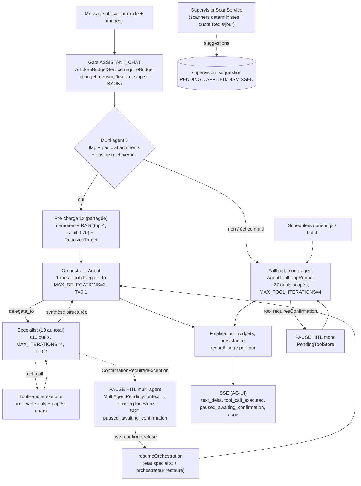

# Phase 0 — Cartographie & audit de l'existant

> Campagne multi-agent Baitly — livrable Gate 0. Date : 2026-07-01.
> Méthode : 5 sous-agents d'audit parallèles (cartographie agentique, catalogue d'outils, économie/monétisation, couverture métier, supervision/Constellation) + contre-vérifications de l'orchestrateur sur les points de divergence. Toute affirmation est ancrée dans le code (working tree du 2026-07-01, modifs non commitées incluses : refonte supervision + migration 0293).

---

## 0. Correction de prémisse : la couche agentique N'EST PAS Spring AI

Le brief de campagne suppose « bâti sur Spring AI (ChatClient, Advisors, ToolCallback, PgVectorStore) ». **C'est faux dans le code réel** :

- Aucune dépendance `spring-ai` dans `server/pom.xml` (vérifié : aucun artifactId spring-ai/langchain/langgraph).
- La couche agentique est un **framework custom maison** sous `server/src/main/java/com/clenzy/service/agent/` : `AgentOrchestrator` (25K), `AgentToolLoopRunner` (20K), `ToolRegistry`, `ToolHandler`, `MultiAgentFlowRunner` (21K), `multiagent/OrchestratorAgent` (56K) + 10 specialists, ~60 outils, `AgentPromptComposer`, `ContextBudget`, `PendingToolStore` (HITL).
- Les équivalents fonctionnels des concepts Spring AI existent déjà en custom : ChatClient → `ChatLLMProvider`/`ChatLLMRouter` multi-provider (Anthropic/OpenAI/NVIDIA-Bedrock) avec failover (`FailoverChatLLMProvider`) ; Advisors → composition dans `AgentPromptComposer` + hooks du loop runner ; ToolCallback → `ToolHandler`/`ToolDescriptor` (JSON Schema) ; ChatMemory → historique persisté (`AssistantMessage`) + fenêtrage `ContextBudget` ; PgVectorStore → RAG custom pgvector (`kb_document`/`kb_chunk`, `KbSearchService`).

**Conséquence** : une décision structurante non prévue au brief s'impose (→ `DECISIONS.md` D-002) : consolider le custom (recommandation intuitive : il est mature et couvre déjà caching/HITL/failover/scoping, que Spring AI ne fournit pas tous nativement) vs migrer. À trancher en Phase 1/3, options comparées à produire. Dans la suite du document, les concepts du brief sont mappés sur leurs équivalents custom réels.

---

## 0.1 Cartographie technique

### 0.1.1 Graphe logique réel

Architecture **duale** : orchestration multi-agent par délégation (primaire) + mono-agent stateful (fallback). Bascule multi-agent par défaut (`clenzy.assistant.multi-agent.enabled=true`), repli mono si : attachments (vision), `roleOverride`, specialists indisponibles, ou erreur multi (`MultiAgentFlowRunner.canUse()`:99-111).

Preuves : `AgentOrchestrator.handleMessage`:235-334, `MultiAgentFlowRunner`:62-165, `OrchestratorAgent`:50-60/207-213/354-378, `AgentToolLoopRunner`:38/67-219.

### 0.1.2 Tableau des agents runtime

| Agent | Rôle | Modèle (résolution) | Outils | Déclencheurs | Garde-fous | Autonomie / HITL | Preuve |
|---|---|---|---|---|---|---|---|
| **OrchestratorAgent** | Méta-orchestration : délégation aux specialists | `AiTargetResolver.resolvePrimary()` (config DB par feature, BYOK ou plateforme) | 1 meta-tool `delegate_to` | Tout message user (si multi actif) | MAX_DELEGATIONS=3, max_tokens=1024, T=0.1, cache anti-boucle de délégations | Pause native `MultiAgentConfirmationPauseException` | OrchestratorAgent.java:50-60, 354-378 |
| **DataAnalyst** | Listes, KPI, réservations, occupation | hérite du target résolu | 10 (read-only) | stems « reserv/occupation/disponib » | 4 itér., 2048 tok, T=0.2 | aucune action mutante | DataAnalystSpecialist.java:49-62 |
| **Finance** | Bilans, factures, payouts, impayés | idem | 9 | stems « finance/facture/paiement » | idem | `settle_intervention_payment` → confirm | FinanceSpecialist.java:48-62 |
| **Operations** | Interventions, calendrier, résas, factures | idem | 10 | stems « intervention/menage/calendrier » | idem | 4 outils mutateurs → confirm | OperationsSpecialist.java:49-62 |
| **Insights** | Simulations prix, portfolio, benchmark | idem | 8 | stems « prix/yield/benchmark/portfolio » | idem | read-only (simulations informatives) | InsightsSpecialist.java:49-62 |
| **Communication** | Messages guests, avis, upsells | idem | 7 | stems « message/guest/review » | idem | `send_guest_message`, `cancel_reservation` → confirm | CommunicationSpecialist.java:49-62 |
| **Monitoring** | Sync channels, bruit, prédictif ops | idem | 8 | stems « sync/bruit/monitoring » | idem | read-only | MonitoringSpecialist.java:48-62 |
| **Context** | Météo, événements locaux, KB | idem | 3 | stems « meteo/evenement » | idem | read-only | ContextSpecialist.java:48-62 |
| **Memory** | Faits utilisateur persistants | idem | 2 | stems « memo/remember » | idem | write mémoire (sans confirm) | MemorySpecialist.java:48-62 |
| **Navigation** | Suggestions de routes UI | idem | 1 | implicite | idem | read-only | NavigationSpecialist.java:48-62 |
| **Workflow** | Procédures guidées pas-à-pas | idem | 2 | stems « workflow/procedure » | idem | avancée guidée | WorkflowSpecialist.java:48-62 |
| **Mono-agent (fallback)** | Assistant unifié legacy | idem (+ `modelOverride` possible, ex. briefings Haiku) | ~27 scopés (`ToolScopeSelector` + `RoleToolPolicy`) | fallback, vision, briefings, batch | MAX_TOOL_ITERATIONS=4, 2048 tok, T=0.3, tour final sans outils | HITL pause/reprise complet | AgentToolLoopRunner.java:38, 67-219 |

**Mapping vs roster cible du brief** : les « agents actuels connus » (Réservations, Opérations/Ménage, Finance/Reporting, Communication Voyageur) correspondent en réalité à 10 specialists plus fins + 1 orchestrateur + des scanners supervision déterministes (`BusinessAnalyticsScanner`, etc.). Pas de tiering de modèle par agent : **tous les specialists héritent du même modèle résolu** pour la feature ASSISTANT_CHAT (granularité specialist-level absente — levier Phase 1).

### 0.1.3 Flux de contexte & mémoire — les 6 leviers d'optimisation déjà en place

Le commit `bc98774e` (« optimisation tokens (6 leviers) + comptabilite cache ») a déjà livré une partie du programme de la Phase 1 du brief :

| # | Levier | Mécanisme | Preuve |
|---|---|---|---|
| 1 | **Scoping d'outils** | ~60 outils → 15-22 exposés par domaine détecté (stems sur les 3 derniers messages user), socle core de 6, plafond MAX_EXPOSED=26 | ToolScopeSelector.java:37-240 |
| 2 | **Bornage contexte** | Fenêtre glissante 24 messages (intégrité tool_call/result préservée) + cap 8 000 chars par retour d'outil envoyé au LLM (l'original reste persisté/affiché) | ContextBudget.java:21-50, ConversationHistoryMapper.java:82-101 |
| 3 | **System prompt allégé** | Few-shot 6→3 exemples, prompt segmenté, rien de hardcodé | AgentPromptComposer.java:49-150 |
| 4 | **Prompt caching** | Anthropic : `cache_control: ephemeral` sur le préfixe `tools+system` (l.497) + breakpoint sur le dernier bloc de l'historique (l.407-447) ; facturation `billedInput = fresh + cacheRead×0.1 + cacheWrite×1.25` (l.222-224). OpenAI : suffixe volatil (date/RAG/mémoire) rattaché au **dernier message user** pour préserver le préfixe cacheable ; `billed = prompt − cached×0.5` | AnthropicChatProvider.java:66, 407-447, 497 ; OpenAiChatProvider.java:301-302, 408-425 ; ChatEvent.java:73-78 ; ComposedSystemPrompt.java |
| 5 | **Bornes d'itération** | Mono 5→4 tours, orchestrateur ≤3 délégations, repli gracieux « tour final sans outils » au lieu d'une erreur | AgentToolLoopRunner.java:38, 196-219 ; OrchestratorAgent.java:55, 414-426 |
| 6 | **Multi-agent par défaut** | Pré-charge unique mémoires+RAG+target partagée orchestrateur/specialists ; fallback mono transparent | MultiAgentFlowRunner.java:62, 99-111 ; AgentOrchestrator.java:235-244 |

Mémoire : historique persisté en DB (`AssistantMessage`, avec tool_calls JSON + tokens + modèle réel utilisé), mémoires long-terme user (`AssistantMemoryService`, tools `remember_fact`/`forget_fact`), RAG pgvector (`kb_chunk` vector(1024), top-4, seuil 0.70, auto-injection dans le suffixe volatil). **Pas de résumé/compression d'historique long** (au-delà de 24 messages : élagage sec, pas de rolling summary) — levier restant pour la Phase 1.

### 0.1.4 HITL — mécanisme exact

1. Un outil `requiresConfirmation=true` déclenche la pause : mono → `PendingToolStore.put(toolCallId, …, pendingHistory)` ; multi → `ConfirmationRequiredException` du specialist capturée en `MultiAgentPendingContext` (historique specialist + historique orchestrateur + id de délégation) puis `MultiAgentConfirmationPauseException` (OrchestratorAgent.java:354-378).
2. SSE `tool_confirmation_request` + `paused_awaiting_confirmation` → le front affiche la carte de confirmation.
3. Reprise : `POST /api/agui/run` avec `resume{interruptId, confirmed}` → `resumeAfterConfirmation` (mono, AgentOrchestrator.java:360-423) ou `resumeOrchestration` (multi, MultiAgentFlowRunner.java:215-266) — exécution réelle de l'outil puis poursuite de la boucle avec le résultat injecté.
4. Persistance à 2 niveaux : in-memory JVM (état complet, TTL 30 min) + index Redis best-effort (`agui:pending:{keycloakId}`, survit au reload de page mais pas au reboot serveur pour l'état complet).

Second circuit HITL, org-scopé et asynchrone : les **suggestions de supervision** (`supervision_suggestion` Postgres, statuts PENDING→APPLIED/DISMISSED, transition CAS atomique, `SuggestionActionExecutor` à l'apply, TTL 7 jours) — SupervisionSuggestionService.java:132-143, SupervisionController.java:95-100.

Niveaux d'autonomie : flags `clenzy.assistant.multi-agent.enabled` et `…multi-agent.hitl.enabled`, + `requiresConfirmation` par outil. **Pas encore de matrice autonomie par agent × par tenant** (autonome/notifier/suggérer/confirmer) telle que visée par le brief — à construire en Phase 3.

### 0.1.5 Dettes techniques observées (priorisées)

1. **Pas de granularité modèle par specialist** — tout ASSISTANT_CHAT sur un seul modèle résolu ; le tiering Phase 1 n'a pas de point d'accroche actuel (MultiAgentFlowRunner.java:108).
2. **Stems du ToolScopeSelector naïfs** (`startsWith` sans frontière de mot) → sur-exposition d'outils hors sujet = tokens gaspillés (ToolScopeSelector.java:196-206).
3. **PendingToolStore in-memory** : reboot serveur pendant une pause HITL = perte de l'état complet (index Redis seul survit) ; perte silencieuse côté UI si Redis KO (PendingToolStore.java:192-221).
4. **Budget tokens vérifié en pré-vol par tour mais enregistré post-facto** : un tour multi-agent en rafale peut dépasser la limite mensuelle avant détection (AgentToolLoopRunner.java:110-113, 253-254) — précisément le trou que la Phase 2 (réservation→réconciliation) doit fermer.
5. **Vision non optimisée** : image base64 ré-encodée à chaque itération de la boucle (≈4k tokens × 4 tours) (AnthropicChatProvider.toAnthropicImageBlock:347-363).
6. **Transition multi→mono peut perdre/dupliquer des widgets** (cas de pause HITL, commenté volontaire) (AgentOrchestrator.java:293-311).
7. **Deux exceptions de confirmation homonymes** (`multiagent.ConfirmationRequiredException` vs exception de base) — risque d'import erroné.
8. **Couverture de tests des cas limites HITL/fenêtrage à confirmer** (non explorée en profondeur par l'audit).

---

## 0.2 Catalogue d'outils (inventaire)

**60 outils** enregistrés (`ToolRegistry` : auto-découverte Spring des `ToolHandler`, unicité des noms vérifiée au boot) — 45 lecture / 15 mutateurs. **Tous les mutateurs sont sous gate HITL** sauf `remember_fact`/`forget_fact` (mémoire user, sans risque métier). Définitions ≈ 200-300 tokens/outil (description FR + JSON Schema) → ~18k tokens si tout exposé, réduits à ~4,5-6,6k par le scoping.

Sécurité : **aucun outil n'expose d'argument `organizationId`** ; la validation tenant est héritée des services métier (filtres Hibernate + `findByIdRespectingTenant`) ; `RoleToolPolicy` restreint les rôles opérationnels (TECHNICIAN/HOUSEKEEPER/…) à 5 outils. Audit trail : `AgentActionAuditService` — **écritures uniquement**, résumé d'arguments tronqué 512 chars, masquage PII/secrets, async fire-and-forget (AgentActionAuditService.java:80-84).

| Domaine | Outils (R = lecture, W = mutateur ⚠ = HITL) |
|---|---|
| **Réservations** | `list_reservations` R, `get_reservation_details` R, `get_reservation_trend` R, `create_reservation` W⚠ (prix serveur via PriceEngine, anti-double-booking), `cancel_reservation` W⚠, `update_reservation_status` W⚠ |
| **Pricing/Revenue** | `get_price_quote` R, `set_rate_override` W⚠ (bulk upsert), `recommend_price_adjustments` R, `simulate_pricing_change` R, `benchmark_competition` R, `forecast_demand_longterm` R, `suggest_upsells` R |
| **Calendrier/Ops** | `get_availability` R, `block_calendar_day` W⚠ (refuse dates passées), `batch_block_calendar` W⚠, `preview_batch_block_calendar` R, `simulate_calendar_block` R, `get_occupancy_forecast` R |
| **Finance** | `get_financial_summary` R (filtre rôle JWT), `get_billing_overview` R, `get_owner_payout_summary` R, `get_property_pnl` R, `list_invoices` R, `create_invoice` W⚠, `settle_intervention_payment` W⚠ (lien Stripe) |
| **Interventions** | `list_cleaning_tasks` R, `get_interventions_by_status` R, `create_intervention` W⚠, `assign_intervention` W⚠, `update_intervention_status` W⚠ (state machine + InterventionAccessPolicy), `detect_unpaid_interventions` R, `predict_maintenance_needs` R, `detect_operational_risks` R |
| **Communication/Guests** | `send_guest_message` W⚠, `reply_to_review` W⚠, `list_guests` R, `segment_guests` R, `list_reviews` R, `analyze_reviews` R |
| **Propriétés** | `list_properties` R, `get_property_details` R, `get_property_amenities` R, `get_properties_performance` R, `update_property_status` W⚠, `get_weather_forecast` R |
| **Channels** | `get_channel_sync_status` R, `get_channel_attribution` R |
| **Analytics** | `analyze_portfolio` R, `get_dashboard_summary` R, `get_business_insights` R, `get_ops_analytics` R, `get_local_events` R, `get_noise_alerts` R |
| **Mémoire/KB/Nav** | `remember_fact` W, `forget_fact` W, `search_knowledge_base` R, `suggest_navigation` R |
| **Workflows** | `start_workflow` R, `advance_workflow` R |

Toutes les listes sont paginées (max 50) ; retours JSON compacts, certains avec hint d'affichage widget (`chart_bar`, `chart_line`).

**Points de vigilance sécurité** (aucun trou critique constaté) : (a) la sécurité tenant repose à 100 % sur la discipline des services appelés — un futur service sans `requireSameOrganization` créerait un trou invisible depuis l'outil → règle à ajouter à la checklist Phase 4 ; (b) `set_rate_override` ne rejette pas les dates passées (mineur) ; (c) PendingToolStore volatil (accepté, TTL 30 min).

**Outils manquants vs opérateur pro** (nourrit Phases 4-5) : remboursement/avoir, règles tarifaires paramétriques (saisons, last-minute, min-stay — seul l'override ponctuel existe), traduction/multilingue, parité tarifaire cross-OTA (lecture seule aujourd'hui), alertes personnalisées, export audit/conformité, templates de messages, ouverture/fermeture de dispos par canal, gestion caution/litige, screening voyageur.

---

## 0.3 Audit économique — baseline tokens/coût & monétisation

### 0.3.1 Metering existant (socle réel pour la Phase 2)

- **Table `ai_token_usage`** (migration Liquibase `0072__create_ai_token_tables.sql` — l'entité JPA est `AiTokenUsage.java`) : 1 ligne **par appel LLM** avec org, feature (`AiFeature` : ASSISTANT_CHAT, EMBEDDINGS, STUDIO_ASSIST, CONTENT, DESIGN, PRICING, MESSAGING, ANALYTICS, SENTIMENT), provider, modèle **réellement utilisé**, promptTokens, completionTokens, monthYear. Écrit via `AiTokenBudgetService.recordUsage()` (REQUIRES_NEW) depuis `AgentToolLoopRunner.recordUsageSafe()`:263-302 et `MultiAgentFlowRunner`:360-369.
- **Comptabilité cache** : tokens cachés distingués (Anthropic `cache_read/creation_input_tokens`, OpenAI `cached_tokens`) et convertis en « billed tokens » (ChatEvent.java:73-78).
- **Exposition** : REST `/api/ai/usage/{stats|breakdown|daily}` (`AiTokenUsageController`) + front `AiUsageTrendSection.tsx` (coût USD par provider/modèle via `LlmPricingService`).
- **Prix** : `LlmPricingService.java:33-86`, table **hardcodée** prefix-match → (input$/M, output$/M) ; ne distingue pas encore cache-read/cache-write dans la grille (calculé côté provider en « billed ») ; fallback modèle inconnu = 0 $ + warn (à durcir en Phase 2 : un taux à zéro = crédit non débité).

**Verdict Phase 2** : le socle « Advisor de metering » demandé par le brief **existe déjà** (usage par appel, par org, par feature, cache compté). Il manque : la conversion en **crédits** avec table de taux **versionnée**, le **ledger immuable par run/step** (`ai_token_usage` n'a pas de run_id/step), la **réservation pré-vol atomique**, et le lien à Stripe.

### 0.3.2 Quotas & enforcement existants

| Mécanisme | Portée | Enforcement | Preuve |
|---|---|---|---|
| `ai_token_budgets` (limite mensuelle par org × feature, défaut 100k tokens) | plateforme (skippé si BYOK) | pré-vol `requireBudget()` → `AiBudgetExceededException` ; mais granularité par tour → dépassement possible en rafale | AiTokenBudgetService.java:143-167 |
| `SupervisionScanQuota` | scans supervision / jour / org | Redis Lua atomique, **fail-closed** si Redis KO | SupervisionScanQuota.java |
| Bornes de boucle | par run | 4 itérations mono, 3 délégations, 2048 tokens output/tour | AgentToolLoopRunner.java:38 |
| ContextBudget | par requête | 24 messages, 8k chars/retour outil | ContextBudget.java:21-50 |

Manques : pas de throttle sur les runs batch parallèles, pas de dégradation en cascade (basculer vers un modèle cheap à 90 % du budget), pas de quota embeddings par org, pas de décrément atomique de solde (le pattern Redis Lua de `SupervisionScanQuota` est le bon modèle à généraliser en Phase 2).

### 0.3.3 Monétisation actuelle

- **Forfaits Stripe existants** (`SubscriptionService` + webhooks) : `essentiel / confort / premium`, prix PMS par utilisateur (`PricingConfigService.getPmsMonthlyPriceCents()`), upgrade via Checkout. **Aucun lien entre usage IA et facturation** : le coût affiché dans l'UI est purement informatif.
- **Qui paie les clés** : 3 régimes — (1) clés plateforme (env) : Clenzy absorbe 100 % du coût provider, sous le seul garde-fou des 100k tokens/mois/feature ; (2) **BYOK par org** (`org_ai_api_keys`, AES-256, unique org×provider) : l'org paie son provider, budget non enforced ; (3) fallback Bedrock/NVIDIA gratuit. Résolution : `AiTargetResolver` (config DB `PlatformAiFeatureModel` + BYOK + repli env).
- **Conclusion** : le modèle économique actuel est « IA incluse à perte contrôlée » — exactement ce que la Phase 2 doit remplacer par crédits + hard cap + top-up (décisions D-100…D-105 déjà tranchées).

### 0.3.4 Baseline de coût par type de run (estimations statiques depuis le code — à confirmer par mesure en Phase 1)

| Type de run | Appels LLM | Tokens in/out (est.) | Coût (est., Sonnet sauf mention) | Fondement |
|---|---|---|---|---|
| Chat mono-agent, 1 tour | 1 | ~2 500 / 500 | ~0,010 $ (≈0,005 $ avec cache) | system ~1,2k + outils scopés ~1,5-4k + historique fenêtré + question |
| Chat mono-agent, 4 itérations d'outils | 4 | ~8 000 / 1 200 | ~0,045 $ | contexte réutilisé, cache sur itérations 2-4 |
| Tour multi-agent (orchestrateur + 1-3 specialists) | 3-8 | ~15-25k / 2-3k | ~0,10-0,20 $ | orchestrateur ~10k + ~5k/specialist + RAG |
| Briefing quotidien | 1 | ~3 000 / 800 | ~0,004 $ (Haiku) | modelOverride Haiku |
| Recherche RAG (embedding) | 1 | ~500 / 0 | ~0,0001 $ (voyage-3-lite) | 1 embed + rerank optionnel |
| Analyse vision (1 image) | 1-4 | +4k tokens/image/itération | +0,05 $ | image base64 ré-envoyée chaque tour |
| Scan supervision | 0-N | scanners **déterministes** (0 LLM) + suggestions | ~0 $ LLM | BusinessAnalyticsScanner = règles, pas de LLM |

Profil type (host 10 logements, 5 chats/j + supervision) ≈ **1,5-2,5 $/mois de coût provider** — c'est la marge de manœuvre du pricing en crédits : même avec un markup ×5-10, le prix client reste très acceptable.

### 0.3.5 Gouffres à tokens restants (après les 6 leviers)

1. **Multi-agent par défaut** : un tour orchestré coûte 5-10× le mono pour des questions simples — le routage n'a pas d'étage « classification d'intention par petit modèle » qui court-circuiterait la délégation (plus gros levier restant).
2. **Pas de tiering par specialist** (tout sur le modèle ASSISTANT_CHAT résolu).
3. **Vision ré-encodée à chaque itération** (~16k tokens perdus par image sur un run à 4 tours).
4. **Stems de scoping approximatifs** → outils hors-sujet exposés.
5. **Pas de rolling summary** de l'historique long (élagage sec à 24 messages : perte de contexte OU relance de recherche d'outils).
6. **Fallback pricing 0 $** pour modèle inconnu → sous-comptage silencieux du coût.

---

## 0.4 Audit métier — couverture vs opérateur professionnel

### 0.4.1 Matrice 16 domaines (PMS classique / couche agentique)

| # | Domaine | PMS classique | Agentique | Manque principal |
|---|---|---|---|---|
| 1 | Revenue/Yield | ⚠️ Partiel (`AdvancedRateManager`, YieldRules, RateOverride) | ✅ Couvert (recommend/simulate/benchmark/forecast) | pricing dynamique temps réel, règles d'élasticité, push tarifaire proactif |
| 2 | Distribution/Channel | ⚠️ Partiel (9 canaux, `ChannelSyncService`, iCal + Airbnb API) | ⚠️ Partiel (lecture statut/attribution seulement) | parité temps réel, anti-overbooking cross-canal, contenu annonces |
| 3 | Cycle réservation | ✅ Couvert (CRUD, `CancellationRefundService`, cautions) | ✅ Couvert (create/cancel/update sous HITL) | workflow litiges, modifications batch |
| 4 | Communication voyageur | ⚠️ Partiel (multilingue, WhatsApp Meta, `AiMessagingService`) | ✅ Couvert (send/segment sous HITL) | orchestration multicanal, priorisation de boîte, escalade |
| 5 | Check-in/out/accès | ✅ Couvert (SmartLock Nuki/KeyNest, OnlineCheckIn, instructions) | ⚠️ Partiel | instructions contextuelles IA, gestion d'exceptions (clé perdue, retard) |
| 6 | Ménage/turnover | ✅ Couvert (`InterventionService`, photos, lifecycle) | ⚠️ Partiel (list/create/assign) | scheduling optimal, contrôle qualité vision, linge |
| 7 | Maintenance | ✅ Couvert (curatif complet) | ⚠️ Partiel (`predict_maintenance_needs` embryonnaire) | préventif calendarisé, prédiction IoT, gestion prestataires |
| 8 | Finance & paiements | ✅ Couvert (Stripe/GoCardless, `ReconciliationService`, ledger, NF) | ⚠️ Partiel (lecture + create_invoice/settle) | rapprochement intelligent, forecast trésorerie, **remboursement** |
| 9 | Fiscalité & conformité | ❌ Quasi absent (`TouristTaxService` basique, fiche police FR) | ❌ Absent | TVA multi-pays, déclarations, plafonds locaux, e-invoice complet |
| 10 | Avis & réputation | ⚠️ Partiel (fetch, sentiment) | ✅ Couvert (analyze/reply sous HITL) | sollicitation auto post-checkout, monitoring continu |
| 11 | Relation propriétaire | ⚠️ Partiel (`OwnerStatementService`, contrats + e-signature, payouts) | ❌ Absent (1 outil lecture payout) | cockpit propriétaire temps réel, commissions flexibles, transparence |
| 12 | Analytics/BI/prévision | ⚠️ Partiel (KPI, rapports PDF) | ✅ Couvert (portfolio, forecast, anomalies, briefing) | anomaly detection temps réel, corrélations cross-property |
| 13 | Marketing & résa directe | ⚠️ Partiel (Booking Engine/Studio, upsells, livret) | ❌ Absent | SEO, A/B annonces, fidélisation, outils agent marketing |
| 14 | Screening & sécurité | ❌ Quasi absent (Guest Declaration seule) | ❌ Absent | KYC, scoring fraude (le scoring fraude booking engine existe côté direct — non exposé à l'agent) |
| 15 | Approvisionnement & stocks | ⚠️ Léger (`PropertyInventoryService`) | ❌ Absent | seuils intelligents, réassort, prédiction saisonnière |
| 16 | Incidents & crise | ❌ Quasi absent (`IncidentService` fiche basique) | ❌ Absent | playbook, escalade automatique, communication d'urgence |

**Synthèse** : agentique fort sur 6/16 (revenue-analyse, résa, communication, avis, analytics, ménage partiel) ; **4 domaines à zéro des deux côtés** (fiscalité, screening, stocks, crise) ; 2 domaines où le PMS est bon mais l'agent absent (propriétaire, marketing).

### 0.4.2 Lecture par segment

- **Particulier (1-3 logements)** : fonctionnel de bout en bout (résa→paiement→check-in→ménage→messages) ; bloquants : fiscalité mono-pays, zéro screening, dépendance OTA (résa directe = Studio encore jeune).
- **Conciergerie (multi-propriétaires)** : socle présent (relevés, contrats signés, payouts, commissions NF via `CommissionInvoiceService`) mais **pas de cockpit propriétaire temps réel** ni de transparence produit — churn risk majeur au-delà de ~10 mandats. C'est aussi le segment le plus rentable pour la facturation à l'usage (autonomie premium multi-logements).
- **Petit hôtel/aparthotel** : **non adressable en l'état** — pas de staff scheduling, pas de résa groupe, pas de GDS, pas de P&L par département. Décision de cadrage à prendre en Phase 6 (l'adresser est un chantier produit, pas un chantier agent).

### 0.4.3 Top 10 des manques métier priorisés

1. Fiscalité multi-pays (TVA, enregistrement, taxe séjour paramétrique) — bloquant expansion UE.
2. Screening & anti-fraude voyageur (KYC, scoring, listes) — risque légal/assurance.
3. Cockpit propriétaire temps réel (conciergerie) — churn + **différenciateur naturel Constellation** (vue lecture seule propriétaire, cf. Phase 6).
4. Marketing & résa directe outillée pour l'agent (annonces, SEO, fidélisation).
5. BI temps réel & détection d'anomalies (au-delà du briefing).
6. Maintenance préventive + prédiction IoT (Minut déjà intégré : données disponibles).
7. Parité & anti-overbooking cross-OTA temps réel.
8. Playbook incidents/crise avec escalade.
9. Approvisionnement intelligent (seuils, réassort).
10. Staff management (seulement si le segment hôtel est retenu).

---

## 0.5 Supervision « Constellation » & décision D-001 (transport post-LangGraph)

### 0.5.1 État actuel

- **Front** (`client/src/modules/supervision/`) : data-contract UX-first dans `types.ts` (Agent{status,autonomy,task,metrics}, PendingAction, StreamEvent, OrchestratorSnapshot) — **déjà découplé** de CopilotKit/LangGraph (le commentaire types.ts:1-11 référençant LangGraph est obsolète). Source de données : `AgUiSupervisionProvider.ts` = SSE AG-UI (`POST /api/agui/run`, fetch + ReadableStream) + endpoints REST déterministes (suggestions, payout-reminder, unpaid-service-requests).
- **Back** : `AgUiController` (SSE, pool dédié 10-100 threads), traduction `AgentSseEvent→AgUi` ; `supervision_suggestion` + `supervision_activity` (Postgres, migration 0293 en cours) ; `PendingToolStore` (HITL user-scopé).
- **Ce qui n'existe PAS** : tables `agent_run`/`agent_step` (aucune rejouabilité), topic Kafka agents.*, usage de STOMP pour la supervision (l'infra STOMP `/ws` + SimpleBroker existe mais sert les conversations — WebSocketConfig.java:48-63).

### 0.5.2 Options de transport comparées

| Option | Description | Coût/Effort | Risque | Gain |
|---|---|---|---|---|
| **A — Statu quo SSE** | garder SSE seul | 0 | perte d'événements à la déconnexion, pas de replay, pas de multi-client | aucun |
| **B — Topologie du brief** : Postgres `agent_run/agent_step` + Kafka → STOMP | remplacer le transport supervision par STOMP broadcast alimenté Kafka | ~10 h + Kafka sur le chemin temps réel + gestion broker | complexité opérationnelle, latence ↑, migration front | replay + multi-client + broadcast org |
| **C — Hybride (recommandée)** : SSE conservé pour le temps réel + `agent_run`/`agent_step` Postgres écrits en async (événement Kafka best-effort, hors chemin critique) + endpoint replay `GET /api/agui/history/{runId}` ; STOMP en option Phase ultérieure si multi-client requis | ~6 h | minimal (patterns best-effort déjà éprouvés : SupervisionActivityService, PendingToolStore Redis) | replay/time-travel + audit complet, zéro rupture front |

**Recommandation argumentée : Option C.** (1) Le SSE AG-UI est déjà en production et le front n'exige aucun changement de contrat — on ajoute un `runId` optionnel aux StreamEvent. (2) Kafka est déjà là (17 topics) mais le mettre **sur le chemin critique** du temps réel (option B) dégrade la latence et la simplicité pour un besoin (multi-client broadcast) qui n'est pas encore avéré ; en async il donne l'audit/replay sans risque. (3) Le HITL applicatif proposé par le brief (`pending_action` Postgres) existe déjà en deux circuits complémentaires (PendingToolStore user-scopé + supervision_suggestion org-scopé) — il faut les **unifier/durcir** (persister l'état complet de pause en Postgres plutôt qu'en mémoire JVM), pas les recréer. (4) Les shapes du data-contract Constellation sont conservés, conformément au brief. Migrations en **Liquibase** (`NNNN__create_agent_run_tables.sql`, PAS de V100 Flyway).

Écart restant vs brief : le brief propose STOMP comme transport principal — l'audit montre que STOMP n'apporterait aujourd'hui que le multi-client (plusieurs onglets/utilisateurs observant la même constellation org). Si ce besoin est confirmé (vue propriétaire lecture seule de la Phase 6 !), le pont Kafka→STOMP `/topic/supervision/{orgId}` s'ajoute en incrément sans toucher au reste. **Décision demandée à la Gate 0** (D-001).

---

## 0.6 Divergences inter-agents résolues par contre-vérification

| Claim d'un sous-agent | Verdict | Preuve |
|---|---|---|
| « Prompt caching Anthropic non détecté en code » (cartographie) | **Faux** — implémenté | AnthropicChatProvider.java:66, 407-447, 497 (`cache_control ephemeral` sur préfixe tools+system + breakpoint historique) |
| « Pas de migration Liquibase pour les tables IA, auto-créées par JPA » (économie) | **Faux** | `0072__create_ai_token_tables.sql` |
| « Tables créées via Flyway » (constellation) | **Faux** — projet 100 % Liquibase | `db.changelog-master.yaml` |
| Nombre d'outils : « 82 fichiers » vs « 60 outils » | **60 outils** (82 fichiers incluent Args/helpers non-outils) | ToolRegistry au boot |

Limites de l'audit : les coûts par run sont des **estimations statiques** (tailles de prompts lues dans le code, pas de mesure Micrometer en conditions réelles) ; la couverture de tests HITL/fenêtrage n'a pas été auditée ; les scanners de supervision étant en refonte non commitée, leur périmètre peut bouger.

---

## 0.7 Synthèse Gate 0

1. **Le système est plus avancé que le brief ne le suppose** : framework agentique custom mature (multi-agent + HITL pause/reprise + failover multi-provider), 6 leviers d'optimisation tokens déjà livrés, metering par appel avec comptabilité cache déjà persisté et exposé. La Phase 1 partira d'un existant à ~70 % — ses plus gros gains restants : routage court-circuit par petit modèle, tiering par specialist, rolling summary, vision.
2. **La monétisation est le chantier le plus vierge** : aucun lien usage↔facturation, budget mensuel contournable en rafale, BYOK non facturé. Mais les briques Phase 2 ont des ancrages nets : `ai_token_usage` → ledger, `SupervisionScanQuota` (Redis Lua fail-closed) → décrément atomique, `AiBudgetExceededException` → hard cap, forfaits Stripe existants → credit grants.
3. **Couverture métier** : forte sur le cœur (résa/ops/finance/analytics), 4 domaines à zéro (fiscalité, screening, stocks, crise), 2 domaines à fort levier différenciant (cockpit propriétaire, marketing/direct).
4. **Constellation** : SSE en prod, pas de replay ; recommandation Option C (SSE + persistance async agent_run/agent_step + replay), STOMP en incrément si multi-client confirmé.
5. **Décisions à trancher à cette gate** : D-001 (transport — reco Option C) et calendrier de D-002 (custom vs Spring AI — reco : trancher en début de Phase 1, biais « consolider le custom »).
