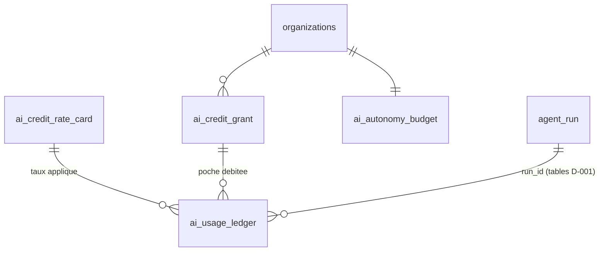
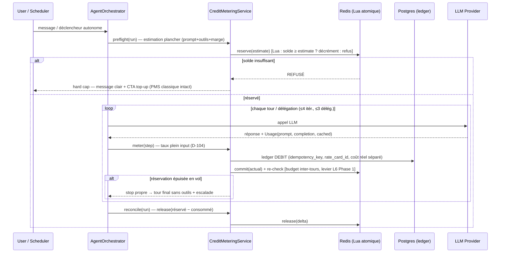

# Phase 2 — Facturation à l'usage (crédits IA, Stripe)

> Campagne multi-agent Baitly — livrable Gate 2. Date : 2026-07-02.
> Cadre : décisions D-100…D-105 (crédit normalisé ; hard cap + top-up ; pas de rollover ; Stripe seul mais design portable ; caching gardé en marge = débit au tarif input plein ; autonomie socle incluse + premium sur sous-budget plafonné). Ces décisions ne sont pas re-débattues — elles sont implémentées.
> Ancrages code : `ai_token_usage` + `AiTokenBudgetService` (metering existant), `SupervisionScanQuota` (Redis Lua atomique), forfaits `essentiel/confort/premium` (`PricingConfigService.java:183-185`), `WebhookController` (webhooks Stripe existants), `StripeGateway` (RequestOptions + idempotency keys — composant canonique), `AiTargetResolver`/`KeySource` (BYOK).

---

## 1. Décision ouverte à cette gate — D-003 : sort du BYOK dans le modèle à crédits

Aujourd'hui les orgs BYOK (`org_ai_api_keys`) paient leur provider et sont **exemptées** de budget (`AiTokenBudgetService`:161-167). Dans un monde à crédits :

| Option | Description | Trade-offs |
|---|---|---|
| A. BYOK gratuit (statu quo) | pas de débit crédits | simple ; mais toute la valeur agentique (orchestration, outils, HITL, Constellation) est donnée — fuite de monétisation, incite les gros comptes à sortir |
| **B. BYOK à taux réduit (reco)** | débit à ~30 % du taux plein (la part « plateforme » : orchestration, outils, features), le coût provider restant chez le client | monétise le logiciel agentique sans double-facturer les tokens ; taux dédié dans la table de conversion (`key_source` dimension) |
| C. Supprimer le BYOK | tout le monde sur clés plateforme | capture 100 % de la marge mais churn des comptes attachés à leurs clés/conformité |

**Recommandation : B** — cohérente avec « on vend de l'IA orchestrée, pas des tokens ». À trancher à la Gate 2.

---

## 2. Unité de compte & table de conversion versionnée (§2.1 du brief)

### 2.1 Le crédit

- **1 crédit = 0,02 € de valeur client** (facial). Unité interne : **millicrédit** (entier, jamais de flottant — même règle que les centimes Stripe). Affichage : crédits à 1 décimale.
- **Markup cible ×5** sur le coût provider **plein tarif** (l'économie du prompt caching reste intégralement en marge — D-104 : le débit client applique le taux input plein aux `promptTokens` totaux, statut cache ignoré). Marge brute cible ≈ 75-80 % après frais Stripe.

### 2.2 Table de conversion versionnée — `ai_credit_rate_card`

```sql
-- Liquibase NNNN__create_ai_billing_tables.sql (append-only : on ferme une version, on n'update jamais un taux)
CREATE TABLE ai_credit_rate_card (
  id BIGSERIAL PRIMARY KEY,
  provider VARCHAR(32) NOT NULL,            -- anthropic | openai | nvidia | voyage
  model_prefix VARCHAR(64) NOT NULL,        -- prefix-match, même convention que LlmPricingService
  token_type VARCHAR(16) NOT NULL,          -- INPUT | OUTPUT  (pas de type CACHED côté client : D-104)
  key_source VARCHAR(16) NOT NULL DEFAULT 'PLATFORM',  -- PLATFORM | ORGANIZATION (D-003 option B)
  provider_cost_micro_usd_per_1k INT NOT NULL,  -- coût provider plein tarif (audit marge)
  millicredits_per_1k INT NOT NULL,             -- taux client (markup inclus)
  effective_from TIMESTAMPTZ NOT NULL,
  effective_to TIMESTAMPTZ,                     -- NULL = version courante
  created_by VARCHAR(64) NOT NULL
);
```

Chaque ligne de ledger référence `rate_card_id` → **rejouabilité et audit de tout débit historique**. Le fallback « modèle inconnu = 0 $ » de `LlmPricingService` est interdit ici : modèle sans taux → **run refusé en pré-vol** + alerte admin (un taux à zéro = crédit non débité en silence).

**Grille initiale proposée** (parité EUR/USD supposée, à calibrer ; markup ×5 ; alignée sur les tiers Phase 1) :

| Tier / modèle | Coût provider in/out ($/Mtok) | Taux client in/out (crédits / 1k tokens) |
|---|---|---|
| Petit (Haiku 4.5) | 0,8 / 4 | **0,2 / 1,0** |
| Standard (Sonnet) | 3 / 15 | **0,75 / 4,0** |
| Fort (Opus/Fable-class) | 15 / 75 | **4,0 / 20,0** |
| Embeddings (voyage-3-lite) | 0,02 / — | 0,005 / — (arrondi min 1 millicrédit) |
| BYOK (D-003 B) | — | 30 % des taux ci-dessus |

**Coût en crédits des actions types** (stable et prévisible pour le client — conséquence directe de D-104) :

| Action | Profil tokens (post-Phase 1) | Crédits | Valeur client |
|---|---|---|---|
| Question simple (routée mono, Sonnet) | ~2,5k in / 0,5k out | **≈ 4** | 0,08 € |
| Analyse multi-agent (2-3 specialists) | ~20k in / 2,5k out | **≈ 25** | 0,50 € |
| Briefing quotidien (Haiku) | ~3k in / 0,8k out | ≈ 1,4 → **socle : 0 débité** | — |
| Rapport approfondi / what-if (tier fort partiel) | ~30k in / 4k out mixte | **≈ 100-150** | 2-3 € |
| Ajustement tarifaire auto (premium) | ~6k in / 1k out Sonnet | **≈ 8** | 0,16 € |

---

## 3. Modèle de données (ledger, poches, autonomie)



### 3.1 `ai_usage_ledger` — append-only, source de vérité temps réel

```sql
CREATE TABLE ai_usage_ledger (
  id BIGSERIAL PRIMARY KEY,
  organization_id BIGINT NOT NULL,
  keycloak_user_id VARCHAR(64),
  run_id UUID NOT NULL,                  -- = agent_run.id (D-001 : même modélisation)
  step_seq INT NOT NULL,                 -- itération/délégation dans le run
  agent VARCHAR(48) NOT NULL,            -- orchestrator | specialist:<nom> | mono | scan:<module> | embedding
  feature VARCHAR(32) NOT NULL,          -- AiFeature existant
  entry_type VARCHAR(16) NOT NULL,       -- DEBIT | GRANT | EXPIRY | ADJUSTMENT | REFUND
  autonomy_bucket VARCHAR(16) NOT NULL,  -- INTERACTIVE | SOCLE | PREMIUM_AUTO
  pocket VARCHAR(16),                    -- SUBSCRIPTION | TOPUP (null pour GRANT/EXPIRY)
  grant_id BIGINT,                       -- poche débitée
  provider VARCHAR(32), model VARCHAR(64),
  prompt_tokens INT, completion_tokens INT,
  cached_read_tokens INT, cached_write_tokens INT,  -- traçage marge UNIQUEMENT (D-104)
  rate_card_id BIGINT,                   -- version du taux appliqué
  millicredits BIGINT NOT NULL,          -- négatif = débit
  provider_cost_micro_usd BIGINT,        -- coût réel (cache déduit) → pilotage marge
  idempotency_key VARCHAR(128) NOT NULL UNIQUE,  -- run_id:step_seq:attempt → pas de double comptage retry
  created_at TIMESTAMPTZ NOT NULL DEFAULT now()
);
-- Index : (org, created_at), (run_id), (org, autonomy_bucket, created_at)
```

Points clés : **jamais d'UPDATE/DELETE** (correction = `ADJUSTMENT` compensatoire) ; le ledger porte à la fois le débit client (tarif plein) et le coût réel (cache déduit) → la marge de caching est mesurable ligne à ligne sans affecter le client ; `run_id`/`step_seq` réutilisent les tables `agent_run`/`agent_step` décidées en D-001 (une seule modélisation).

### 3.2 `ai_credit_grant` — les deux poches (D-101/D-102)

```sql
CREATE TABLE ai_credit_grant (
  id BIGSERIAL PRIMARY KEY,
  organization_id BIGINT NOT NULL,
  source VARCHAR(16) NOT NULL,           -- SUBSCRIPTION | TOPUP | PROMO
  millicredits_granted BIGINT NOT NULL,
  millicredits_consumed BIGINT NOT NULL DEFAULT 0,  -- matérialisé, réconcilié vs ledger
  granted_at TIMESTAMPTZ NOT NULL,
  expires_at TIMESTAMPTZ NOT NULL,       -- SUBSCRIPTION : fin de cycle ; TOPUP : +12 mois
  stripe_ref VARCHAR(64),                -- checkout session / invoice / credit grant id
  UNIQUE (stripe_ref)                    -- idempotence webhook
);
```

**Ordre de consommation** (D-102, « ne pas gâcher le périssable ») : poche SUBSCRIPTION du cycle courant d'abord, puis poches TOPUP par `expires_at` croissant (FIFO d'expiration). Expiration = job quotidien qui écrit une ligne `EXPIRY` au ledger (auditabilité du non-consommé).

### 3.3 `ai_autonomy_budget` — sous-budget premium plafonné (D-105)

```sql
CREATE TABLE ai_autonomy_budget (
  organization_id BIGINT PRIMARY KEY,
  premium_cap_millicredits BIGINT NOT NULL,      -- plafond par cycle (défaut : selon forfait)
  on_cap_behavior VARCHAR(16) NOT NULL DEFAULT 'NOTIFY_ONLY',  -- PAUSE | NOTIFY_ONLY
  behaviors JSONB NOT NULL DEFAULT '{}'          -- toggles par comportement autonome (scan tarifaire, rapports…)
);
```

Mécanique : l'autonomie premium **puise dans les poches normales** (pas une 3e poche) mais son cumul de cycle (somme ledger `autonomy_bucket=PREMIUM_AUTO`) est **borné par le cap** — atteint → pause ou bascule « notifier seulement », jamais de siphonnage de l'interactif. L'autonomie **socle** (auto-réponses, alertes anomalie, briefing de base) est débitée **0 crédit** mais tracée (`SOCLE`, coût réel renseigné) : le client voit ce que le système fait pour lui « inclus », et nous pilotons ce coût absorbé.

### 3.4 Solde chaud — Redis atomique, Postgres source de vérité

Généralisation du pattern `SupervisionScanQuota` (Lua, **fail-closed**) : hash Redis `ai:credits:{orgId}` = {sub_remaining, topup_remaining, premium_consumed}, scripts Lua `reserve(estimate)` / `commit(actual, released)` / `release(reservation)` atomiques. Rechargé depuis Postgres au boot/cache-miss ; toute écriture Redis a son pendant ledger (le ledger corrige Redis, jamais l'inverse). Redis KO → **fail-closed** pour les runs facturables (le PMS classique continue, D-101).

---

## 4. Metering — réutilisation de l'existant (§2.2)

Les points d'écriture actuels (`AgentToolLoopRunner.recordUsageSafe`, `MultiAgentFlowRunner.finalizeMultiAgentTurn`, pipeline `AiTokenBudgetService.recordUsage`) deviennent des appels à un **`CreditMeteringService`** unique qui : lit l'`Usage` du `ChatEvent` (tokens prompt/completion/cachés — déjà disponibles), résout le taux (`rate_card` courante), écrit la ligne de ledger (idempotency_key = `run_id:step_seq:attempt`), commit le décrément Redis. Règles héritées du brief, toutes ancrées : **streaming** = usage final au `message_stop`/dernier chunk (déjà le cas : `recordUsageSafe` lit l'outcome final) ; **retries** = clé d'idempotence unique par step ; **échec en cours de run** = on ne débite que les appels réellement effectués (débit par step, pas par run) ; `ai_token_usage` existant reste alimenté pendant une phase de transition puis devient une **vue** du ledger (pas deux vérités).

---

## 5. Séquence pré-vol → réservation → réconciliation (§2.4)



L'estimation plancher = tokens du prompt composé (connus avant envoi) + définitions d'outils + marge forfaitaire par itération prévue ; volontairement conservatrice (< coût probable) pour ne pas sur-bloquer — le vrai garde-fou est le **re-check inter-tours** (protège du runaway, levier L6).

---

## 6. Intégration Stripe (§2.5-2.6) — deux variantes comparées

Contrainte vérifiée sur la doc Stripe : les **billing credits ne s'appliquent qu'à des lignes d'abonnement liées à un prix metered**. Or notre modèle est hard cap **sans overage** (D-101) : aucune facturation d'usage a posteriori, donc aucun montant d'usage à compenser sur facture.

| | **Variante 1 — Stripe = tiroir-caisse pur (reco)** | Variante 2 — Meters + credit grants natifs |
|---|---|---|
| Abonnement | prix fixe existant (essentiel/confort/premium) ; la dotation de crédits est créée **par notre backend** à chaque `invoice.paid` (ligne GRANT + poche SUBSCRIPTION) | prix fixe + prix metered 0-net : meter events agrégés poussés, credit grants Stripe compensent la ligne metered |
| Top-up | Stripe Checkout one-shot → webhook `checkout.session.completed` → poche TOPUP (+12 mois) | credit grant API avec expiry 12 mois + Checkout |
| Enforcement | 100 % chez nous (Redis+ledger) — **exigé par D-103 de toute façon** (Stripe ne bloque pas en temps réel) | idem chez nous ; Stripe n'ajoute qu'une vitrine |
| Complexité | minimale : subscriptions + Checkout + 6 webhooks, briques déjà en place (`WebhookController`, `StripeGateway`) | meters + agrégation Redis + flush périodique + rate limits + réconciliation ledger↔meters permanente |
| Transparence client | jauge + ledger dans NOTRE UI (Constellation §8) — plus riche que la facture Stripe | usage visible sur la facture Stripe |
| Portabilité (D-103) | totale — changer de PSP = refaire Checkout/webhooks | couplage au moteur de metering Stripe (racheté Metronome 01/2026 : API en évolution — risque) |
| Frais | processing (~1,5 % + 0,25 € cartes EU / 2,9 % + 0,30 $ US) + Billing 0,5-0,8 % sur le volume abonnement (l'hypothèse 0,7 % du brief est le bon ordre) — intégrés au markup ×5 | idem |

**Recommandation : Variante 1.** Le brief demande Meters+credit grants **et** un design portable où « le solde/enforcement vit chez nous » — les deux sont en tension, et la décision hard-cap-sans-overage (D-101) retire l'unique cas où le metering Stripe est indispensable (facturer l'excédent). La Variante 1 satisfait toutes les décisions D-100…D-105 avec 3× moins de surface. Si un jour un plan « overage autorisé » apparaît, la Variante 2 s'ajoute sans casser le ledger (il émet alors des meter events). **À valider à la Gate 2 (écart assumé vs §2.5 du brief).**

**Webhooks (idempotents, pattern existant `WebhookController` + vérification de signature)** : `checkout.session.completed` (top-up → GRANT ; **retry queue + job de réconciliation « payé sans solde »** : scan des sessions payées sans `stripe_ref` en poche → re-crédit), `invoice.paid` (dotation mensuelle + reset du cap autonomie), `invoice.payment_failed` (grâce 7 j puis gel des dotations — les top-ups restent), `customer.subscription.updated/deleted` (prorata de dotation à l'upgrade ; à la résiliation : poche SUBSCRIPTION expire, TOPUP survit 12 mois), `charge.refunded` (ADJUSTMENT négatif + clawback poche).

---

## 7. Réconciliation double (§2.7)

1. **Marge (ledger ↔ factures providers)** : job mensuel — Σ `provider_cost_micro_usd` par provider vs facture Anthropic/OpenAI ; écart > 5 % → alerte (dérive de la grille `LlmPricingService`/rate card ou fuite de comptage). Le gain de cache réel (coût réel < débit plein tarif) est reporté comme **métrique de marge** (Grafana, tag existant `assistant.tokens`).
2. **Revenu (ledger ↔ Stripe)** : job mensuel — Σ GRANT×prix des poches vs paiements Stripe encaissés ; toute poche sans paiement réconcilié = incident.

---

## 8. UX & transparence — intégrée Constellation (§2.8)

- **Jauge de crédits temps réel** dans le header Constellation (deux poches distinctes + barre du sous-budget autonomie premium) — alimentée par le canal temps réel existant (SSE) + endpoint solde.
- **Alertes 80/95/100 %** : in-app + email (infra notifications existante) ; à 100 % → bannière hard cap + CTA top-up.
- **Estimation avant action coûteuse** : toute action > seuil (déf. 50 crédits) affiche « cette analyse consommera ~X crédits » (l'estimation pré-vol §5 est réutilisée telle quelle) avec confirmation — cohérent avec les cartes HITL existantes.
- **Ledger lisible** : historique par agent/run dans Constellation, chaque action autonome premium étiquetée (« Ajustement tarifaire auto — 8 crédits ») ; les actions socle affichées « incluses ».
- **Écrans forfaits + top-up** : extension de l'écran billing existant (packs 500/2 000/10 000 crédits, Checkout).
- **Panneau autonomie** : toggles par comportement (`ai_autonomy_budget.behaviors`), plafond premium éditable sous le max du forfait, comportement au plafond (pause / notifier).

---

## 9. Grille de forfaits chiffrée par segment (§2.9 — nourrit la Phase 6)

Hypothèses : coût provider ≈ 20 % du prix crédit (markup ×5, cache en marge en plus) ; prix PMS de base existants inchangés (la colonne « + IA » s'ajoute). **Chiffres = proposition à calibrer à la gate.**

| | **Particulier** (Essentiel) | **Conciergerie** (Confort/Pro) | **Conciergerie+ / petit hôtel** (Premium) |
|---|---|---|---|
| Supplément IA / mois | **+9 €** | **+29 €** | **+79 €** |
| Crédits inclus / cycle | 500 (≈ 100 interactions simples) | 2 000 | 8 000 |
| Autonomie **socle** (incluse, 0 crédit) | auto-réponses, alertes, briefing quotidien | idem | idem |
| Sous-budget autonomie **premium** | 0 (activable via top-up) | 500 crédits | 2 500 crédits |
| Tiers de modèles | Haiku/Sonnet | + tier fort sur Insights | tout, priorité tier fort |
| Features à crédits majorés | — | what-if, benchmark | rapports lourds, prévisions long terme, multi-portefeuille |
| Coût provider max absorbé (si 100 % consommé) | ~2 € | ~8 € | ~32 € |
| Marge brute IA (crédits consommés à 100 %) | ~75 % | ~70 % | ~57 % (avant gain cache) |
| Top-ups | 500 cr = 12 € · 2 000 cr = 40 € · 10 000 cr = 160 € (prix/crédit dégressif 0,024→0,016 €) |||

Lecture : la consommation réelle étant typiquement < 100 % de la dotation (crédits périssables, D-102), la marge effective attendue est > 80 %. Le particulier n'est jamais « puni » (socle inclus) ; la conciergerie paie l'autonomie premium multi-logements — conforme D-105.

---

## 10. Checklist des pièges bordés

- [x] **Caching en marge** : débit au taux input plein (rate card sans type CACHED côté client) ; coût réel avec cache tracé par ligne → marge mesurable (D-104).
- [x] **Streaming** : usage compté au final de l'appel, jamais par chunk (points d'écriture existants inchangés).
- [x] **Retries / double comptage** : `idempotency_key` unique `run_id:step_seq:attempt` (contrainte DB).
- [x] **Échecs** : débit par step réellement exécuté ; réservation relâchée en réconciliation ; erreur provider = 0 débit sur le step échoué.
- [x] **Runaway** : réservation pré-vol + re-check inter-tours + bornes d'itération existantes (4 tours / 3 délégations) + hard cap.
- [x] **Concurrence multi-runs même tenant** : décrément Redis Lua atomique (pattern `SupervisionScanQuota` éprouvé), fail-closed.
- [x] **Webhook top-up perdu** : retry queue + job de réconciliation « payé sans poche » (scan Checkout sessions payées vs `stripe_ref`).
- [x] **Fraude** : signature webhook vérifiée (existant) ; crédits accordés uniquement sur paiement confirmé ; refund → clawback ADJUSTMENT ; grille de taux non exposée en écriture ; montants top-up définis serveur (jamais client — règle absolue n°1 du CLAUDE.md).
- [x] **Modèle sans taux** : run refusé en pré-vol + alerte (fin du fallback 0 $ silencieux).
- [x] **Rollover** : job d'expiration quotidien + ligne EXPIRY auditables (D-102).
- [x] **Hard cap ≠ panne** : seul le multi-agent facturable se coupe ; PMS classique et autonomie socle continuent ; message + CTA (D-101).

---

## 11. Quatre scénarios

**S1 — Run normal.** Host demande « analyse mes performances juillet ». Pré-vol estime 18 crédits, solde 420 → réserve 18. Multi-agent : orchestrateur + DataAnalyst + Insights, 3 steps ledger (DEBIT, bucket INTERACTIVE, poche SUBSCRIPTION), réel 23 crédits (re-check inter-tours a re-réservé +8 au tour 2). Réconciliation : release 3. Constellation affiche « Analyse portefeuille — 23 crédits », jauge 420→397.

**S2 — Hard cap.** Solde 3 crédits, pré-vol estime 15 → refus Lua. SSE renvoie l'événement `credit_cap_reached` : bannière « Crédits épuisés — le PMS continue de fonctionner, l'assistant IA reprendra après rechargement », CTA top-up + rappel renouvellement le 1er. Aucune action IA facturable ne part ; briefing socle du lendemain passe (0 crédit, coût absorbé).

**S3 — Top-up.** Achat pack 2 000 cr (40 €) via Checkout. `checkout.session.completed` (idempotent par `stripe_ref`) → poche TOPUP exp. +12 mois + ligne GRANT + push jauge. Si le webhook échoue : job de réconciliation détecte la session payée sans poche < 15 min → re-crédit + log incident. Consommation : la poche SUBSCRIPTION du cycle reste débitée d'abord.

**S4 — Plafond d'autonomie premium atteint.** Conciergerie, cap premium 500 cr. Le 22 du mois, cumul PREMIUM_AUTO = 496 ; le scan tarifaire proactif suivant estime 8 cr → dépasserait le cap. Comportement configuré NOTIFY_ONLY : le scan tourne en mode dégradé « suggestion sans exécution » (scanner déterministe, 0 LLM) et notifie « Plafond d'autonomie premium atteint — les optimisations automatiques sont en pause jusqu'au 1er (ou relevez le plafond) ». Les crédits interactifs restants (1 200) sont intacts — jamais siphonnés.

---

## Sources (faits marché vérifiés le 2026-07-02)

- [Stripe — Billing credits implementation guide](https://docs.stripe.com/billing/subscriptions/usage-based/billing-credits/implementation-guide) et [Credit Grant API](https://docs.stripe.com/api/billing/credit-grant) — credit grants : montant, expiry, priorité, ledger immuable ; s'appliquent aux lignes liées à un prix metered.
- [Stripe — Meters API](https://docs.stripe.com/api/billing/meter) et [advanced usage-based billing](https://docs.stripe.com/billing/subscriptions/usage-based/advanced/about).
- [Stripe Billing pricing](https://stripe.com/billing/pricing) et analyses tierces ([Flexprice](https://flexprice.io/blog/stripe-pricing-breakdown-2026), [FeeTrace](https://feetrace.com/blog/how-usage-based-billing-changes-your-stripe-processing-costs)) — Billing 0,5-0,8 % + processing ; rachat de Metronome (janv. 2026) = point de veille sur l'API metering.
