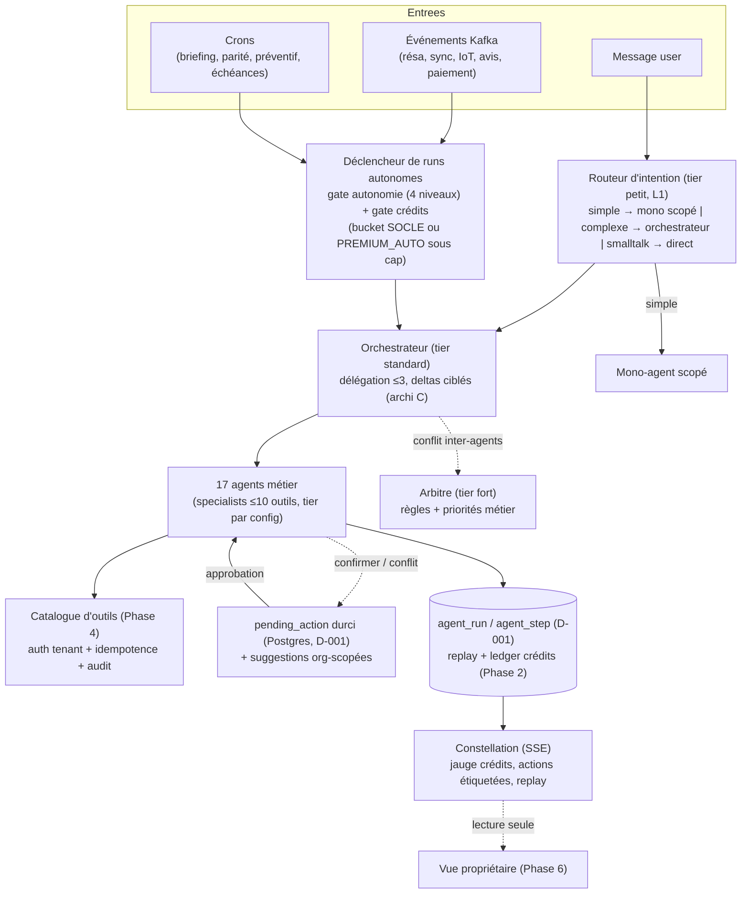

# Phase 3 — Refonte & enrichissement de l'architecture d'agents

> Campagne multi-agent Baitly — livrable Gate 3. Date : 2026-07-02.
> Base : cartographie Phase 0 (10 specialists + orchestrateur + mono fallback existants), tiering Phase 1 (matrice tâche→modèle), buckets d'autonomie Phase 2 (SOCLE / INTERACTIVE / PREMIUM_AUTO). Framework : custom consolidé (D-002), état de run persisté `agent_run`/`agent_step` (D-001).

---

## 1. Principes de conception du roster

1. **Un agent = un mandat métier avec des outils mutateurs qui lui sont propres** — pas un agent par domaine par principe. Un « agent » sans outils ni service métier derrière est un chatbot : les agents des domaines à zéro (fiscalité, screening, stocks, crise — Phase 0 §0.4) sont **conditionnés à la livraison des services PMS sous-jacents** (dépendance Phases 4-5), pas créés en avance.
2. **Réutiliser l'infrastructure existante** : chaque agent = un `AgentSpecialist` (le contrat `AbstractAgentSpecialist` — ≤10 outils, ≤4 itérations, synthèse structurée `SpecialistResult` — a fait ses preuves). Pas de refonte du moteur.
3. **Tier de modèle par agent** = matrice Phase 1, pilotée par config (`PlatformAiFeatureModel` + `agentRole`).
4. **Autonomie à 4 niveaux par agent × par tenant** : `autonome` (agit, trace) / `notifier` (agit + informe) / `suggérer` (propose, n'agit pas) / `confirmer` (gate HITL). Stockée dans la config org (extension de `ai_autonomy_budget.behaviors`), défauts par segment (§6). Le niveau se combine avec le bucket de crédits : socle = toujours incluse ; toute action `autonome`/`notifier` déclenchée sans humain = bucket PREMIUM_AUTO (sous cap).
5. **Correction du brief sur les modèles** : le brief met l'orchestrateur et plusieurs agents sur le tier maximal ; la Phase 1 a montré que l'orchestration est une tâche de routage contrainte (T=0.1, 1024 tokens) → tier standard, le tier fort étant réservé aux mandats où l'erreur coûte des euros réels (yield, conformité, crise).

## 2. Roster cible (17 agents : 10 existants dont 4 étendus, 7 nouveaux)

| Agent | Statut | Mandat | Tier | Autonomie défaut | Déclencheurs | KPI de succès |
|---|---|---|---|---|---|---|
| **Orchestrateur** | existant | routage, délégation, arbitrage inter-agents | Standard (escalade tier fort pour arbitrage de conflit) | — | tout message + événements | précision de routage, coût/run |
| **Revenue/Pricing** | **extension d'Insights** | yield, prix dynamiques, min-stay, gap nights, saisonnalité, événements locaux | **Fort** | suggérer (→ notifier si confiance apprise, Phase 6) | cron quotidien, événement demande, message | RevPAR/ADR vs marché, % suggestions acceptées |
| **Distribution/Channel** | **nouveau** | sync OTA, parité, anti-overbooking, contenu annonces | Standard | notifier | événements Kafka sync, cron parité | lag de sync, incidents parité/overbooking |
| **Réservations** | **extraction d'Operations** | cycle de vie résa, modifs, annulations, litiges, cautions | Standard | confirmer | message, webhook canal | délai de traitement, taux litiges résolus |
| **Communication Voyageur** | existant | messagerie multilingue, réponses contextuelles, priorisation, escalade | Standard | notifier (auto-réponses = socle) | message entrant guest, cron relances | temps de 1re réponse, taux d'escalade |
| **Housekeeping** | **extraction d'Operations** | turnover, affectation, qualité, retards, linge | Petit/Standard | **autonome** (planification) ; confirmer (réaffectations sensibles) | événement résa (check-out), cron J-1 | taux turnover à l'heure, retards détectés |
| **Maintenance** | **nouveau** (embryon : `predict_maintenance_needs`) | ordres de travail, prestataires, préventif, suivi | Standard | confirmer | signalement, IoT Minut, cron préventif | délai résolution, % préventif vs curatif |
| **Finance/Compta** | existant | facturation, encaissements, payouts, rapprochement, remboursements | Standard | confirmer | message, cron impayés, webhook Stripe | impayés détectés, délai rapprochement |
| **Conformité/Fiscalité** | **nouveau — vague 3** (service PMS préalable) | taxe séjour, enregistrement, plafonds, TVA, déclarations | **Fort** | notifier | cron échéances, création résa | échéances tenues, anomalies détectées |
| **Réputation/Avis** | **extraction de Communication** | sollicitation, réponses, sentiment, plan qualité | Standard | suggérer (réponses) / autonome (sollicitation = socle) | événement check-out, webhook avis | note moyenne, taux de réponse |
| **Propriétaire** | **nouveau** | relevés, reversements, reporting, communication, commissions | Standard | notifier | cron mensuel, question propriétaire | délai relevés, satisfaction propriétaire |
| **Analytics/Prévision** | existant (DataAnalyst + briefing) | occupation, RevPAR/ADR, prévisions, anomalies, briefing | Standard (prévisions long terme : fort) | — (lecture seule) | message, cron briefing (socle) | précision forecast, anomalies J-avant |
| **Marketing/Annonces** | **nouveau — vague 3** | optimisation listings, SEO, contenu, résa directe | Standard | suggérer | cron audit annonces, message | part résa directe, conversion listing |
| **Screening/Sécurité** | **nouveau — vague 3** (service KYC préalable ; le fraud scoring booking engine existe, à exposer) | vérification voyageur, anti-fraude, cautions, incidents | Standard | confirmer | création résa | fraudes bloquées, faux positifs |
| **Incident/Crise** | **nouveau** | imprévus (panne, plainte, no-show), coordination cross-agents, playbooks | **Fort** | confirmer | signalement, alerte IoT/bruit, escalade agents | délai de prise en charge, résolutions < 2 h |
| **Approvisionnement/Stocks** | **nouveau — vague 3** (services seuils préalables) | consommables, seuils, réassort | Petit | autonome (sous seuils configurés) | cron inventaire, événement intervention | ruptures évitées |
| **Upsell/Ventes add.** | **nouveau léger** (outil `suggest_upsells` existant + primitive upsells booking engine) | late check-out, transferts, expériences, cross-sell | Petit/Standard | suggérer | événement résa confirmée, J-3 arrivée | revenu upsell/résa |
| *Support (inchangés)* | Context, Memory, Navigation, Workflow, Monitoring | utilitaires transverses (pas des agents métier) | Petit | — | délégation | — |

**Fiches d'implémentation** (pattern commun, détail par agent en Phase 4 pour les outils) : system prompt = mandat + périmètre interdit + format de synthèse (composé par `AgentPromptComposer`, préfixe cacheable) ; outils = sous-ensemble du catalogue Phase 4 (≤10, mutateurs déclarés) ; garde-fous = bornes existantes (4 itér., 2048 tokens) + budget crédits par run (Phase 2) + niveau d'autonomie ; déclencheurs = 3 canaux uniformes : message user (délégation orchestrateur), événement Kafka (nouveau : consumer → run autonome), cron (`scheduler/` existant).

## 3. Schéma cible

## 4. Patterns d'orchestration (sans moteur de graphe — custom consolidé)

- **Routing** : étage L1 (Phase 1) en amont — classification d'intention tier petit ; seuls les agents utiles sont invoqués. Les déclencheurs événementiels court-circuitent l'orchestrateur quand le mandat est mono-agent (ex. check-out → Housekeeping directement).
- **Orchestrateur-workers** : inchangé (`delegate_to`, ≤3 délégations) ; le passage aux **deltas ciblés** (architecture C, adossée à `agent_run`) remplace progressivement l'envoi d'historique aux specialists : mandat + delta d'état + retour `SpecialistResult` structuré.
- **Sous-flux réutilisables** : séquences déterministes multi-agents codées comme services Java (ex. « nouvelle résa » : Screening → Réservations → Housekeeping → Communication), chaque étape étant un run d'agent borné — le flux n'est PAS piloté par LLM (fiabilité + coût). Répond au constat Phase 0 « pas de moteur d'orchestration opérationnel ».
- **HITL unifié** : `pending_action` durci (état complet en Postgres, D-001) absorbe les deux circuits existants (PendingToolStore user-scopé + suggestions org-scopées) sous un modèle unique {origine, agent, action, args, autonomie, expiration, coût estimé en crédits}.
- **Conflits inter-agents** : règles déterministes d'abord (priorités : sécurité > conformité > résa confirmée > revenue > confort opérationnel), arbitrage LLM tier fort seulement si les règles ne tranchent pas ; décision tracée dans `agent_step`.
- **Persistance & replay** : chaque run (interactif ou autonome) écrit `agent_run`/`agent_step` → time-travel Constellation + facturation par step + apprentissage des validations (Phase 6).

## 5. Deux variantes de déploiement comparées

| | **Variante A — roster complet d'emblée** | **Variante B — 3 vagues (reco)** |
|---|---|---|
| Contenu | créer les 17 agents + leurs déclencheurs en un chantier | **V1** (immédiat, outils existants) : extensions Revenue, Réservations, Housekeeping, Réputation + nouveaux Propriétaire, Upsell, Incident (playbook minimal) + routeur L1 + déclencheurs Kafka/cron. **V2** : Distribution, Maintenance (mutateurs à créer, Phase 4). **V3** (dépend de services PMS neufs) : Conformité, Screening, Marketing, Stocks |
| Coût/risque | gros big-bang, agents-chatbots sans outils sur 4 domaines, dilution QA | chaque vague livre des agents **avec** leurs outils ; les domaines à zéro attendent leur socle produit |
| Time-to-value | long | V1 exploitable seule (différenciation conciergerie immédiate : Propriétaire + autonomie premium) |

**Recommandation : B.** Cohérente avec la règle « un agent sans outils est un chatbot » et avec le Top 10 des manques Phase 0 (les services fiscalité/screening/stocks sont des chantiers produit, pas des chantiers agent).

## 6. Matrice d'autonomie par défaut — agent × segment

Niveaux : A = autonome, N = notifier, S = suggérer, C = confirmer, — = non pertinent. Le tenant peut durcir/assouplir par agent (panneau autonomie Phase 2 §8) ; les actions A/N non sollicitées émargent au bucket PREMIUM_AUTO (sous cap) sauf socle.

| Agent | Particulier | Conciergerie | Petit hôtel* |
|---|---|---|---|
| Revenue/Pricing | S | S (→N avec validations apprises) | S |
| Distribution/Channel | N | N | N |
| Réservations | C | C | C |
| Communication Voyageur | N (auto-réponses socle : A) | N | N |
| Housekeeping | A (planif) / C (réaffectation) | A / N | A / N |
| Maintenance | C | C (préventif : N) | N |
| Finance/Compta | C | C | C |
| Conformité/Fiscalité | N | N | N |
| Réputation/Avis | S (sollicitation : A socle) | S | S |
| Propriétaire | — | N (relevés : A socle) | — |
| Analytics/Prévision | — (briefing socle : A) | — | — |
| Marketing/Annonces | S | S | S |
| Screening/Sécurité | C | C | C |
| Incident/Crise | C | C | C |
| Approvisionnement/Stocks | A (sous seuils) | A | A |
| Upsell | S | S (→A sur upsells standards) | S |

\* segment non adressable aujourd'hui (Phase 0) — colonne fournie pour la cible si la décision produit Phase 6 l'ouvre.

Invariant de sécurité (inchangé, règles CLAUDE.md) : quels que soient les niveaux, **paiement, remboursement, annulation, envoi voyageur et modification de tarif ne descendent jamais sous « notifier »**, et tout mutateur reste audité + tenant-validé côté backend.
