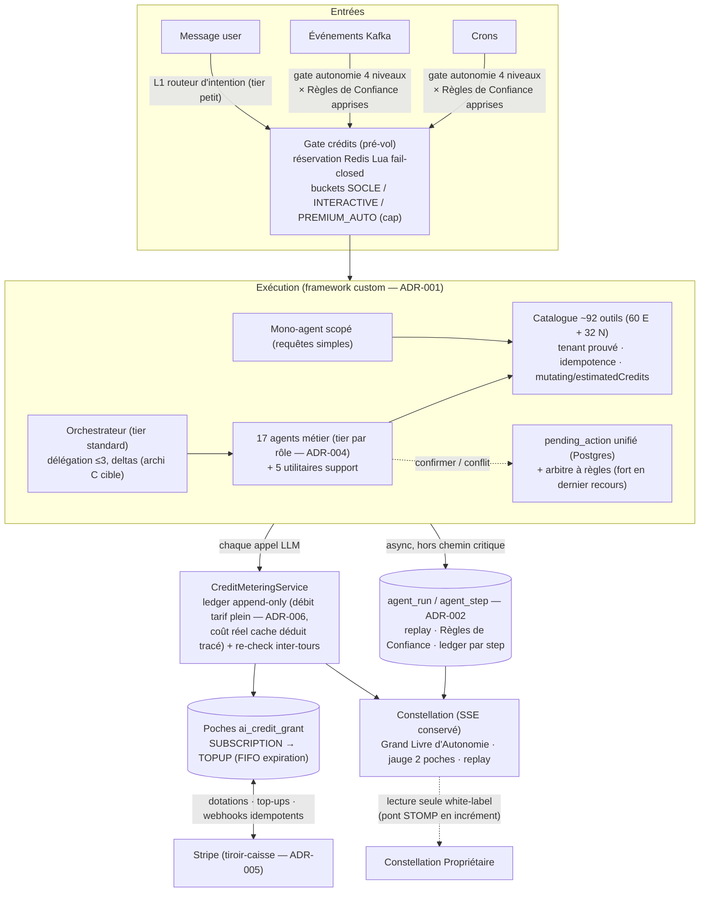

# Phase 7 — Consolidation & feuille de route

> Campagne multi-agent Baitly — livrable Gate 7 (final). Date : 2026-07-02.
> Synthèse exécutive : `/SYNTHESE.md` (racine). ADRs : `campagne/ADRS.md`. Décisions : `campagne/DECISIONS.md`.

---

## 1. Architecture cible consolidée

**Forme de l'état/mémoire partagé** (consolidation) : (1) **conversationnel** — historique persisté (`AssistantMessage`) fenêtré 24 msgs + rolling summary structuré (Next) ; (2) **run** — `agent_run`/`agent_step` : statut, agent, tool, args, résultat, coût — sert replay + facturation + apprentissage ; (3) **long terme** — mémoires user (`AssistantMemoryService`) + RAG pgvector (ADR-003) ; (4) **économique** — ledger + poches + solde Redis ; (5) **gouvernance** — matrice d'autonomie + Règles de Confiance versionnées + `pending_action`. Aucune duplication : chaque donnée a un propriétaire unique, les agents reçoivent des deltas.

## 2. Feuille de route RICE — Now / Next / Later

Scores : R (portée : % clients touchés), I (impact 1-3), C (confiance 1-3), E (effort S/M/L/XL). Priorité = R×I×C / E.

### NOW (0-2 mois) — mesurer, router, facturer, agents V1

| # | Chantier | Flux | R | I | C | E |
|---|---|---|---|---|---|---|
| N1 | Observabilité coût enrichie (tag agent, USD, cache ratio, fallback prix durci) | tokens | 100 % | 2 | 3 | S |
| N2 | Routage court-circuit L1 (classification tier petit) | tokens | 100 % | 3 | 3 | M |
| N3 | Tiering par rôle d'agent (config DB, ADR-004) | tokens | 100 % | 3 | 3 | M |
| N4 | Scoping V2 + compression descriptions + fix vision | tokens | 100 % | 2 | 3 | S |
| N5 | Tables `agent_run`/`agent_step` + écriture async + endpoint replay (ADR-002) | socle | 100 % | 3 | 3 | M |
| N6 | Ledger + rate card + poches + Redis Lua + pré-vol/réservation/réconciliation | billing | 100 % | 3 | 3 | L |
| N7 | Stripe : dotations à `invoice.paid`, Checkout top-up, webhooks + job « payé sans poche » | billing | 100 % | 3 | 3 | M |
| N8 | UX crédits : jauge 2 poches, alertes 80/95/100, ledger UI, estimation pré-action | billing | 100 % | 3 | 2 | M |
| N9 | Agents V1 (Propriétaire, Upsell, Incident minimal + extensions Revenue/Résa/Housekeeping/Réputation) | agents | 80 % | 3 | 2 | L |
| N10 | Outils V1 (initiate_refund, modify_dates, owner_statement, pricing_rules, request_review, translate, credit_balance…) | outils | 80 % | 3 | 3 | M |

### NEXT (2-5 mois) — différenciation visible + agents V2

| # | Chantier | Flux | R | I | C | E |
|---|---|---|---|---|---|---|
| X1 | `pending_action` unifié durci (état complet Postgres) | socle | 100 % | 2 | 3 | M |
| X2 | **Règles de Confiance** (validations apprises, objets visibles/révocables) | diff | 80 % | 3 | 2 | L |
| X3 | **Grand Livre d'Autonomie** (replay UI + coût par action dans Constellation) | diff | 100 % | 3 | 2 | M |
| X4 | Sous-budget autonomie premium + panneau de comportements (ADR-007) | billing | 100 % | 2 | 3 | M |
| X5 | Grille de forfaits crédits en prod (+9/+29/+79 €) + migration BYOK taux réduit (ADR-008) | billing | 100 % | 3 | 2 | M |
| X6 | Rolling summary (architecture contexte B) | tokens | 100 % | 2 | 2 | M |
| X7 | Agents V2 (Distribution, Maintenance) + outils V2 (channel sync, litiges, préventif, payout, incident complet) | agents | 70 % | 3 | 2 | L |
| X8 | Déclencheurs Kafka de runs autonomes + sous-flux déterministes Java (« nouvelle résa ») | agents | 100 % | 2 | 2 | M |
| X9 | **Constellation Propriétaire** (lecture seule white-label + pont STOMP multi-client) | diff | 40 % (conciergeries) | 3 | 2 | L |
| X10 | Réconciliation double (marge providers / revenu Stripe) + quota embeddings org | billing | 100 % | 2 | 3 | S |

### LATER (5-12 mois) — architecture cible + domaines V3

| # | Chantier | Flux |
|---|---|---|
| L1 | Architecture C (blackboard/deltas orchestrateur↔specialists sur agent_run) | tokens |
| L2 | Services + agents V3 : Conformité/Fiscalité, Screening, Marketing, Stocks (16/16 domaines) | agents+outils |
| L3 | What-if & replay avancés (rejouer une décision avec d'autres paramètres) | diff |
| L4 | Pilote per-outcome en crédits (« message résolu sans humain = 3 crédits ») — benchmark Maia >50 % | billing |
| L5 | Stripe Meters si un plan avec overage apparaît (ADR-005 réversible) | billing |
| L6 | Décision produit segment petit hôtel (staff/groupes) — instruite, non engagée | produit |

## 3. Backlog de tickets (extraits prêts à l'emploi — les 12 premiers)

**T-01 · Observabilité coût enrichie (N1, S)** — Contexte : `AgentToolMetrics.TOKENS` sans tag agent ni coût USD ; fallback prix inconnu = 0 $. CA : tag `agent` (12 valeurs fermées) ; métrique coût USD via `LlmPricingService` ; compteur cache read/write ; modèle sans prix → warn + métrique `unknown_model` ; dashboard Grafana.

**T-02 · Routeur d'intention L1 (N2, M)** — Contexte : tout message part en multi-agent (5-10× le mono). CA : appel tier petit ≤300 tokens classant {simple, multi, direct} ; flag `clenzy.assistant.routing.enabled` ; escalade mono→multi si besoin cross-domaine détecté ; mesure avant/après via T-01 ; cible : ≥50 % des requêtes court-circuitées, zéro régression éval qualité.

**T-03 · Tiering par rôle (N3, M)** — Contexte : ADR-004, accroche `resolvePrimary(...)`. CA : colonne/table `agent_role_model` en config DB + UI admin ; specialists utilitaires sur tier petit ; Insights sur tier fort ; fallback = comportement actuel ; test de résolution par rôle.

**T-04 · Migrations agent_run/agent_step + replay (N5, M)** — Contexte : ADR-002 ; Liquibase `NNNN__create_agent_run_tables.sql` (PAS Flyway). CA : écriture async best-effort (pattern SupervisionActivityService) ; `GET /api/agui/history/{runId}` ; runId injecté dans les StreamEvent SSE (optionnel, shapes conservés) ; zéro latence ajoutée au chemin SSE (bench).

**T-05 · Rate card + ledger (N6a, L)** — Contexte : ADR-005/006. CA : tables `ai_credit_rate_card` + `ai_usage_ledger` ; `CreditMeteringService` branché sur les 3 points d'écriture existants ; débit tarif plein + coût réel séparé ; idempotency_key unique testé (retry sans double débit) ; `ai_token_usage` alimenté en parallèle (transition).

**T-06 · Poches + solde Redis + pré-vol (N6b, L)** — Contexte : ADR-005. CA : `ai_credit_grant` (2 sources, FIFO expiration) ; scripts Lua reserve/commit/release (tests concurrence : 2 runs simultanés ne dépassent jamais le solde) ; fail-closed si Redis KO ; job d'expiration quotidien avec lignes EXPIRY ; re-check inter-tours branché dans les boucles (mono + specialists).

**T-07 · Stripe dotations + top-up (N7, M)** — Contexte : ADR-005, `WebhookController`/`StripeGateway` existants. CA : dotation à `invoice.paid` (idempotente par invoice id) ; Checkout top-up 3 packs (montants serveur) ; webhooks signés idempotents ; job réconciliation « payé sans poche » < 15 min ; refund → clawback ADJUSTMENT.

**T-08 · UX crédits (N8, M)** — CA : jauge 2 poches + barre premium dans Constellation ; alertes 80/95/100 (in-app + email) ; écran ledger filtrable par agent/run avec libellés (« Ajustement tarifaire auto — 8 crédits ») ; estimation pré-action > 50 crédits ; écrans forfaits/top-up ; i18n fr/en/ar.

**T-09 · Agent Propriétaire + outils (N9/N10 partiel, M)** — Contexte : services `OwnerStatementService`/`CommissionInvoiceService` existants. CA : specialist ≤10 outils dont generate_owner_statement/send_owner_report/get_commission_breakdown ; relevés = socle 0 crédit ; synthèses rédigées débitées ; checklist sécurité Phase 4 §4 passée (tenant prouvé, test cross-tenant).

**T-10 · initiate_refund (N10, S)** — Contexte : gabarit Phase 4 §3. CA : montant calculé serveur (cross-check si fourni, 400 si écart) ; idempotency Stripe ; hors transaction DB ; HITL `confirmer` invariant ; audit + ledger ; tests : refus cross-tenant, idempotence, écart de montant.

**T-11 · Fix vision + scoping V2 + compression descriptions (N4, S)** — CA : image envoyée au 1er tour uniquement + tool `view_attachment` ; matching stems à frontière de mots (tests faux positifs « préserver »≠« reserv ») ; 60 descriptions ≤150 chars ; mesure tokens/appel avant/après.

**T-12 · pending_action unifié (X1, M)** — Contexte : dette PendingToolStore in-memory (perte au reboot). CA : état complet de pause en Postgres (multi-agent inclus) ; TTL + expiration propre ; reprise après reboot testée ; les deux circuits actuels (user-scopé + suggestions org) servis par le même modèle ; base des Règles de Confiance (X2).

*(Tickets X2-X10 et L1-L6 à détailler à l'entame de leur créneau — même gabarit.)*

## 4. Gains attendus (rappel synthèse)

| Axe | Baseline | Cible | Levier |
|---|---|---|---|
| Coût par interaction | 0,01-0,20 $ | **-55/-70 %** | N1-N4, X6, L1 |
| Revenu IA | 0 (coût absorbé) | **marge brute ≈ 75-80 %** sur crédits (+9/+29/+79 €/mois par plan) | N6-N8, X4-X5 |
| Couverture métier | 6/16 domaines agentiques | 9/16 (V1) → 13/16 (V2) → 16/16 (V3) | N9-N10, X7, L2 |
| Différenciation | parité avec les copilotes du marché | 3 signature features sans équivalent (veille 11 acteurs) | X2, X3, X9 |
| Fiabilité/gouvernance | HITL volatile, pas de replay | runs persistés rejouables, autonomie apprise, invariants sécurité | N5, X1-X3 |
